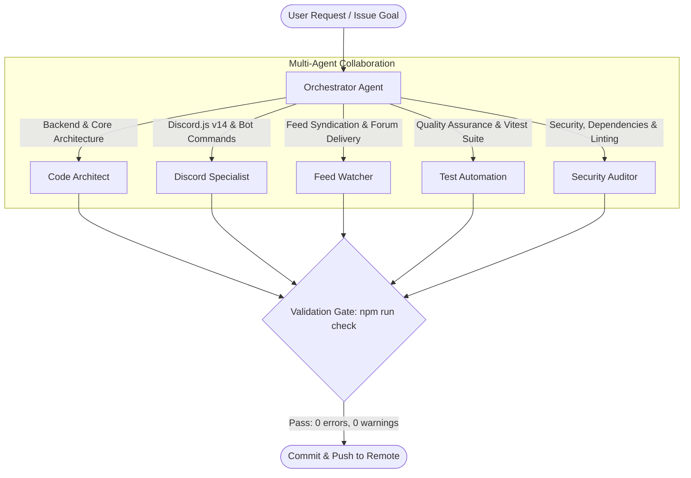

# 🤖 AI Agent Ecosystem (`.agents/`)

This directory contains the operational specifications, mandatory engineering rules, domain skills, and code templates for AI agents, coding assistants, and contributors working on **HELIX Discord Bot**.

> 📖 **Primary Operating Manual**: For high-level project status, architectural mandates, and current issue tracking, refer to the root entry point: [**`AGENTS.md`**](../AGENTS.md).  
> 📝 **Local Tracking**: `PLAN.md`, `BUGS.md`, and `TODO.md` are local-only workspace scratchpads (gitignored) and must never be committed to the repository.

---

## 📁 Ecosystem Structure

| Directory | Purpose | Primary Focus | Link |
|---|---|---|---|
| [**`agents/`**](agents/) | **Agent Roles Catalog** | Specialized engineering agent personas, responsibilities, and workflows | [Browse Agents](agents/README.md) |
| [**`rules/`**](rules/) | **Mandatory Rules** | Non-negotiable safety, architecture, discord.js v14, and code style rules (Rules 00–07) | [Browse Rules](rules/README.md) |
| [**`skills/`**](skills/) | **Domain Skills** | In-depth technical guides for Discord.js, feeds, and SQLite state | [Browse Skills](skills/README.md) |
| [**`templates/`**](templates/) | **Code & Workflow Templates** | Production-ready blueprints for commands, subcommands, events, embeds, and GitHub roadmaps | [Browse Templates](templates/README.md) |

---

## 🔄 Agent Collaboration Workflow

---

## 🛡️ Core Governance & Principles

1. **Safety First (Rule 00)**: Zero irreversible damage, secrets remain exclusively in `.env`, production databases are preserved.
2. **Zero Unsolicited Injection (Rule 01)**: No unapproved third-party runtime dependencies.
3. **Strict Discord.js v14 Standards (Rule 06)**: Self-contained commands with colocated options (`src/bot/commands/<category>/<command>.ts`), dynamic discovery (`src/bot/handlers/loader.ts`), and reusable modular utilities in `src/bot/lib/`.
4. **Mandatory Verification Gate**: All changes must pass `npm run check` (`tsc --noEmit`, `typecheck:test`, `format:check`, `eslint`, and `vitest run`) before any commit.
