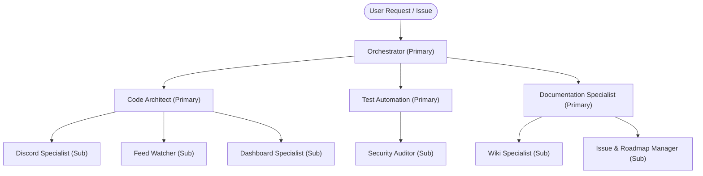

# 👥 Agent Ecosystem (`.agents/agents/`)

This directory defines the agent team specifications for **HELIX Discord Bot**, organized as **primary agents** with **sub-agents** grouped by focus area. Each spec outlines target domains, responsibilities, operational boundaries, permitted tools, and testing commands.

## 🏗️ Structure

Agents are organized into focus-area folders:

```
.agents/agents/
├── orchestrator/                    # Coordination (primary)
├── engineering/                     # Project code (primary + sub-agents)
│   └── sub-agents/
├── quality/                         # Testing & security (primary + sub-agents)
│   └── sub-agents/
└── documentation/                   # wiki, md files, issues (primary + sub-agents)
    └── sub-agents/
```

Each primary agent owns the lifecycle of its sub-agents and delegates focus-specific work to them. Rules (`.agents/rules/`) and templates (`.agents/templates/`) are referenced by the agents that enforce or use them.

## 🔄 Focus-Area Team Structure



## 📋 Agent Catalog

### Primary Agents

| Agent | Focus Area | Key Responsibilities | Specification |
|---|---|---|---|
| **Orchestrator** | Coordination | Task decomposition, roadmap execution, primary-agent coordination, rollback | [orchestrator/orchestrator.md](orchestrator/orchestrator.md) |
| **Code Architect** | Engineering | TypeScript ESM, SQLite write-through, HTTP dashboard, sub-agent ownership | [engineering/code-architect.md](engineering/code-architect.md) |
| **Test Automation** | Quality | Validation gate (`npm run check`), test harnesses, mock servers, sub-agent ownership | [quality/test-automation.md](quality/test-automation.md) |
| **Documentation Specialist** | Documentation | wiki/, md files, issues, rule/skill/template sync, sub-agent ownership | [documentation/documentation-specialist.md](documentation/documentation-specialist.md) |

### Sub-Agents

| Agent | Primary | Key Responsibilities | Specification |
|---|---|---|---|
| **Discord Specialist** | Code Architect | discord.js v14 commands, events, EmbedHandler, `src/bot/lib/` | [engineering/sub-agents/discord-specialist.md](engineering/sub-agents/discord-specialist.md) |
| **Feed Watcher** | Code Architect | RSS/Atom/Reddit ingestion, forum threads, stream alerts | [engineering/sub-agents/feed-watcher.md](engineering/sub-agents/feed-watcher.md) |
| **Dashboard Specialist** | Code Architect | SSR dashboard, Discord OAuth2, theme engine | [engineering/sub-agents/dashboard-engineer.md](engineering/sub-agents/dashboard-engineer.md) |
| **Security Auditor** | Test Automation | Secrets protection, ESLint, formatting, dependency audits | [quality/sub-agents/security-auditor.md](quality/sub-agents/security-auditor.md) |
| **Wiki Specialist** | Documentation Specialist | `wiki/`, README, `.env.example`, `.agents/` catalogs | [documentation/sub-agents/wiki-specialist.md](documentation/sub-agents/wiki-specialist.md) |
| **Issue & Roadmap Manager** | Documentation Specialist | GitHub issues, roadmaps, PRs, release notes | [documentation/sub-agents/issue-manager.md](documentation/sub-agents/issue-manager.md) |

## 📂 Subsystem Ownership Reference

| Subsystem | Source Location | Responsible Agent |
|---|---|---|
| **Discord Bot** | `src/bot/` | Discord Specialist (Engineering) |
| **Modular Lib** | `src/bot/lib/` | Discord Specialist / Code Architect |
| **Dashboard** | `src/dashboard/` | Dashboard Specialist (Engineering) |
| **Persistence** | `src/db/` | Code Architect |
| **State Management** | `src/state/` | Code Architect |
| **Feed Syndication** | `src/feed/` | Feed Watcher (Engineering) |
| **Testing Harnesses** | `tests/` | Test Automation (Quality) |
| **Agent Rules** | `.agents/rules/` | Security Auditor (Quality) / Orchestrator |
| **Documentation** | `wiki/`, README, `AGENTS.md` | Wiki Specialist (Documentation) |
| **Issues & Roadmaps** | GitHub issues/PRs | Issue & Roadmap Manager (Documentation) |