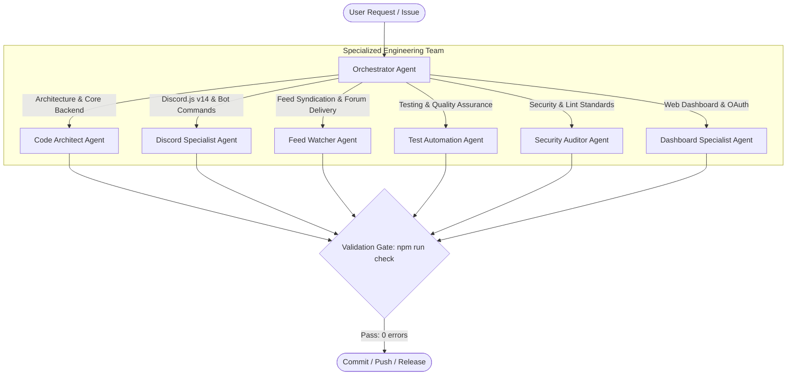

# 👥 Specialized Agent Roles (`.agents/agents/`)

This directory defines the specialized agent team specifications for **HELIX Discord Bot**. Each agent specification outlines target domains, responsibilities, operational boundaries, permitted tools, and testing commands.

---

## 🏗️ Multi-Agent Team Structure

---

## 📋 Agent Roles Catalog

| Agent | Target Domain | Key Responsibilities | Specification File |
|---|---|---|---|
| **Orchestrator** | Project & Workflow Management | Task decomposition, roadmap execution, permission gates, rollback coordination | [orchestrator.md](orchestrator.md) |
| **Code Architect** | Backend & System Design | TypeScript ESM architecture, SQLite write-through state, HTTP dashboard, zero-unsolicited runtime injection | [code-architect.md](code-architect.md) |
| **Discord Specialist** | Discord.js v14 & Bot Engineering | Slash commands, self-contained command files, modular `src/bot/lib/`, events, EmbedHandler, voice gateway | [discord-specialist.md](discord-specialist.md) |
| **Feed Watcher** | Feed Ingestion & Delivery | RSS/Atom/Reddit ingestion, weekly Sunday free games schedule, forum single-thread delivery | [feed-watcher.md](feed-watcher.md) |
| **Dashboard Specialist** | Management Dashboard & OAuth | Zero-frontend-dep SSR, Discord OAuth2, guild admin authorization, EmbedHandler parity, theme engine | [dashboard-engineer.md](dashboard-engineer.md) |
| **Test Automation** | Quality Assurance & Vitest | Modular test suites (`tests/unit/`), mock servers, verification gate (`npm run check`) | [test-automation.md](test-automation.md) |
| **Security Auditor** | Security & Code Quality | Secrets protection, ESLint zero-warning policy, dependency audits, permission guards | [security-auditor.md](security-auditor.md) |

---

## 📂 Subsystem Ownership Reference

| Subsystem | Source Location | Primary Responsible Agent |
|---|---|---|
| **Discord Bot** | `src/bot/` | Discord Specialist |
| **Modular Lib** | `src/bot/lib/` | Discord Specialist / Code Architect |
| **Dashboard** | `src/dashboard/` | Dashboard Specialist |
| **Persistence** | `src/db/` | Code Architect |
| **State Management** | `src/state/` | Code Architect |
| **Feed Syndication** | `src/feed/` | Feed Watcher |
| **Testing Harnesses** | `tests/` | Test Automation |
| **Agent Rules** | `.agents/rules/` | Security Auditor / Orchestrator |
