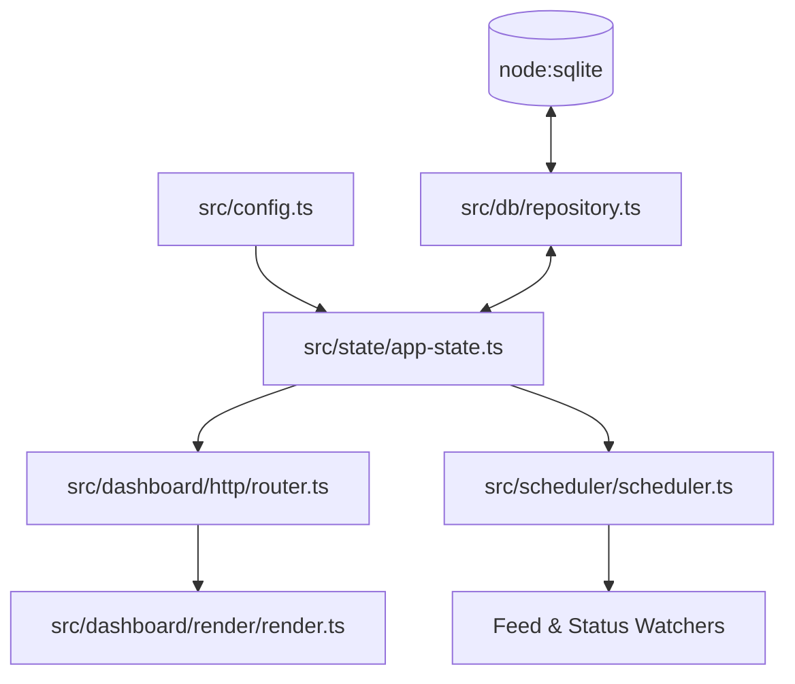

# Code Architect Agent

The **Code Architect Agent** is responsible for system design, backend domain services, TypeScript ESM conventions, database integration, and UI component architecture.

## Architecture



## Standards & Constraints
- **Zero Runtime Dependencies**: Keep the application purely powered by Node.js built-ins (`node:http`, `node:sqlite`, `node:crypto`) and approved coordination layers (`redis`).
- **ESM Syntax**: Strict use of `.js` extensions in all relative imports.
- **Write-Through Persistence**: In-memory `AppState` serves all fast read paths while synchronizing directly to SQLite.
- **Theme Support**: Maintain responsive Light and Dark themes with zero style layout shifts.

## Commands
```bash
npm run typecheck
npm run build
```
