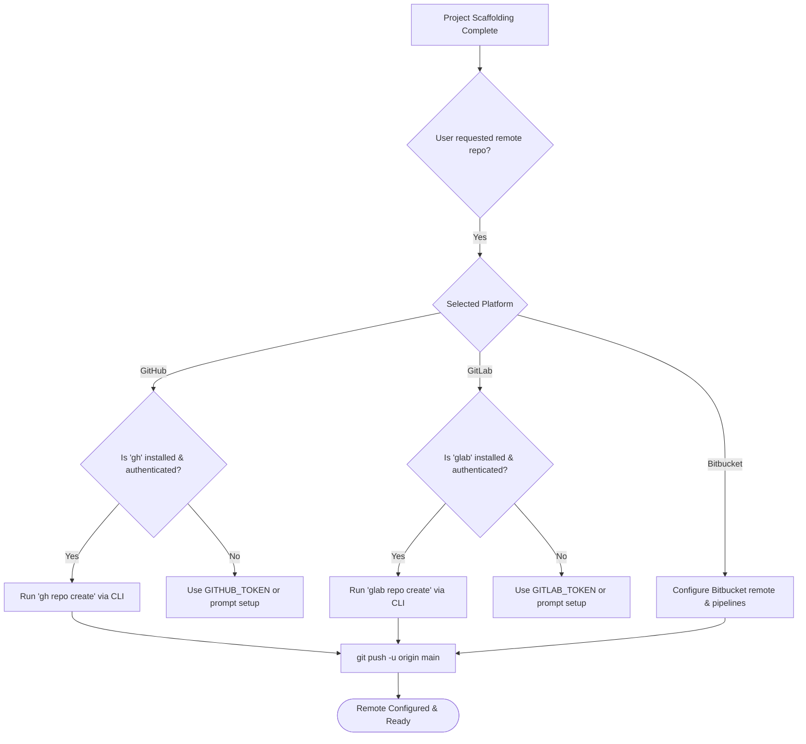

# Code Hosting Platforms Agent

This agent details the conventions, configuration, and runtime interaction between HELIX CLI and supported code hosting platforms: **GitHub**, **GitLab**, **Bitbucket**, and generic/self-hosted Git servers (Gitea, Forgejo, SSH).

## Supported Platforms & Official CLIs

| Platform | Official CLI | Primary Auth Strategy | Remote Management Capabilities |
|----------|--------------|-----------------------|--------------------------------|
| **GitHub** | GitHub CLI (`gh`) | `gh auth login` / `gh auth status` | `gh repo create`, issue tracking, PRs, GitHub Actions |
| **GitLab** | GitLab CLI (`glab`) | `glab auth login` / `glab auth status` | `glab repo create`, merge requests, GitLab CI/CD |
| **Bitbucket** | Git CLI + Bitbucket API | Bitbucket App Passwords / OAuth | Git remote setup, Bitbucket Pipelines |
| **Self-Hosted** | Git CLI / Custom CLI | SSH Keys / Personal Access Tokens | Generic Git remotes, webhooks, forge APIs |

## Architecture & Workflow

HELIX CLI utilizes official CLIs when available to manage remote repositories natively, avoiding manual token juggling.



## CLI Commands for Remote Management

```bash
# Initialize and create a remote repository during project creation
helix create web-app my-store --template web-react --git-platform github --repo-visibility private

# Check status of code hosting CLIs and authentications
helix repo status

# Create a remote repository for an existing local project
helix repo create --platform github --name my-project --visibility public
helix repo create --platform gitlab --name my-project --visibility private
```

## CI/CD Pipeline Scaffolding per Platform

- **GitHub**: Generates `.github/workflows/ci.yml` tailored to the project language/framework.
- **GitLab**: Generates `.gitlab-ci.yml` with stages (build, test, deploy) and Docker image tags.
- **Bitbucket**: Generates `bitbucket-pipelines.yml` with step definitions and caches.
