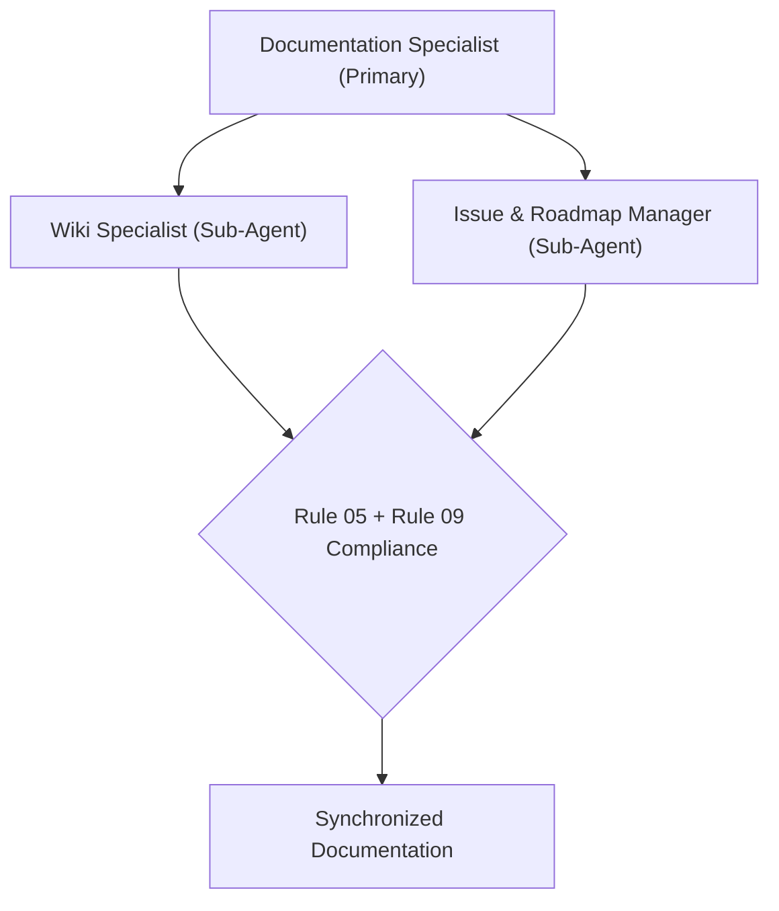

# Documentation Specialist Agent (Primary)

The **Documentation Specialist Agent** is the primary agent for the **documentation focus** of **HELIX Discord Bot**. It owns every non-code artifact in the repository: `wiki/`, `README`, `AGENTS`, `.env.example`, GitHub issues, release notes, and `.agents/` rule/skill/template catalogs. It coordinates the documentation sub-agents and enforces Rule 05 (documentation & wiki synchronization), Rule 04 (remote issue protocol), and Rule 09 (mermaid standards).

## Primary Agent Responsibilities

1. **Documentation Ownership**: Acts as the single accountable agent for all `` files, wiki pages, configuration examples, and user-facing documentation.
2. **Ecosystem Synchronization (Rule 05)**: Keeps `wiki/`, `README`, `AGENTS`, and agent ecosystem catalogs consistent with the actual codebase state.
3. **Sub-Agent Coordination**: Delegates focused documentation work to sub-agents and reviews their output for accuracy and style.
4. **Gates & Standards**: Enforces the Issue Title Standard (simple, human-readable, emoji-led), mermaid-diagram compliance, and the `npm run check` validation gate for any associated code changes.

## Documentation Architecture



## Sub-Agents

| Sub-Agent | Target Domain | Specification |
|---|---|---|
| **Wiki Specialist** | `wiki/`, README, `AGENTS`, `.env.example`, `.agents/` catalogs | [sub-agents/wiki-specialist](sub-agents/wiki-specialist) |
| **Issue & Roadmap Manager** | GitHub issues, roadmaps, PRs, release notes | [sub-agents/issue-manager](sub-agents/issue-manager) |

## Related Specifications & Rules

- **Rule 00**: [Agent Safety & Compliance](../../rules/agent-safety-compliance)
- **Rule 04**: [Remote Issue, PR & Comment Protocol](../../rules/remote-issue-protocol)
- **Rule 05**: [Documentation Standards & Wiki Synchronization](../../rules/documentation-standards)
- **Rule 09**: [GitHub-Flavored Mermaid & Diagram Standards](../../rules/mermaid-standards)

## Templates

- [Issue Roadmap Template](../../templates/issue-roadmap-template)
- [Issue Template](../../templates/issue-template)
- [Release Notes Template](../../templates/release-notes-template)
- [Mermaid Diagram Template](../../templates/mermaid-diagram-template)

## Operational Verification

```bash
# Documentation-only changes do not compile; verify formatting & links
npm run format:check
```