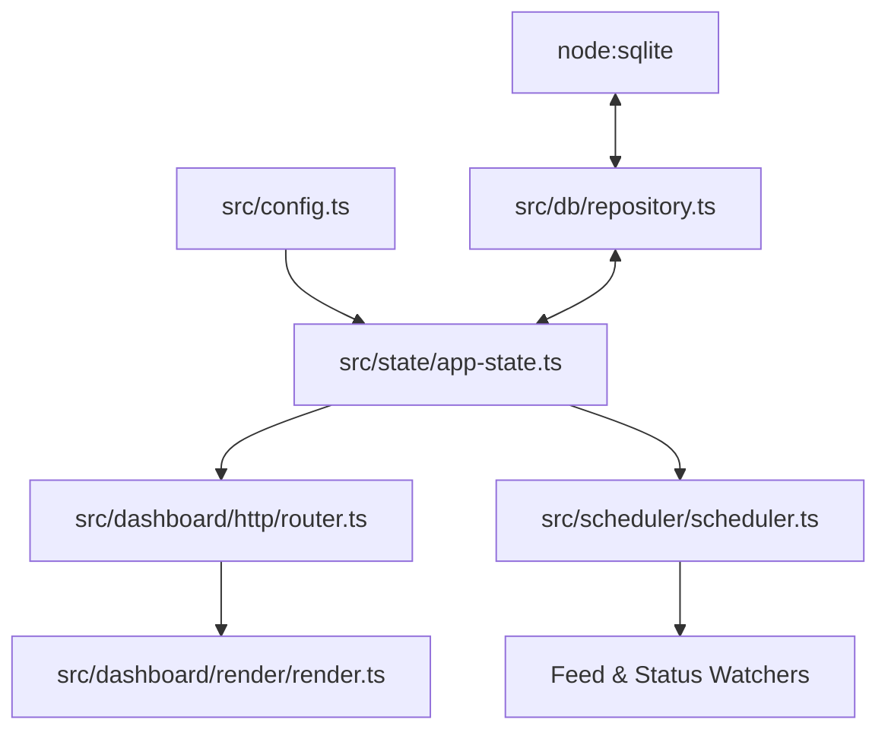

# Code Architect Agent (Primary — Engineering Focus)

The **Code Architect Agent** is the **primary agent** for the **engineering focus**. It is responsible for system design, backend domain services, TypeScript ESM conventions, database integration, and UI component architecture. It coordinates the engineering sub-agents.

## Architecture



## Sub-Agents

| Sub-Agent | Target Domain | Specification |
|---|---|---|
| **Discord Specialist** | Discord.js v14 commands, events, embeds | [sub-agents/discord-specialist.md](sub-agents/discord-specialist.md) |
| **Feed Watcher** | Feed syndication, scraping, thread delivery, stream alerts | [sub-agents/feed-watcher.md](sub-agents/feed-watcher.md) |
| **Dashboard Specialist** | SSR dashboard, Discord OAuth, REST API, theme engine | [sub-agents/dashboard-engineer.md](sub-agents/dashboard-engineer.md) |

## Standards & Constraints
- **Zero Runtime Dependencies**: Keep the application purely powered by Node.js built-ins (`node:http`, `node:sqlite`, `node:crypto`) and approved coordination layers (`redis`).
- **Dynamic Methods Over Hardcoding**: Implement dynamic registries, dynamic discovery, dynamic options/choices, and automated dispatch instead of rigid static tables or hardcoded mappings.
- **ESM Syntax**: Strict use of `.js` extensions in all relative imports.
- **Write-Through Persistence**: In-memory `AppState` serves all fast read paths while synchronizing directly to SQLite.
- **Theme Support**: Maintain responsive Light and Dark themes with zero style layout shifts.

## Commands
```bash
npm run typecheck
npm run build
```
