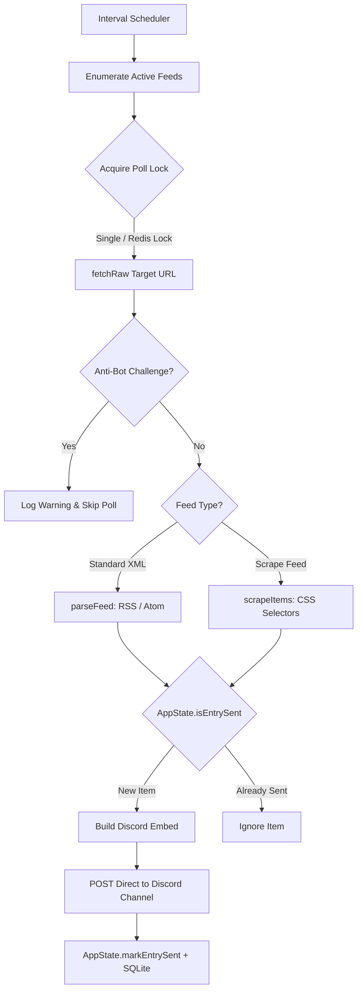

# Feed Watcher Agent

This agent defines architecture, workflow conventions, and execution references for the Discord RSS feed polling and scraping subsystem.

## Architecture



## Key Responsibilities

1. **Scheduled Polling**:
   - Enumerate all enabled feeds from `repo.listFeedsForAllUsers()`.
   - Acquire distributed locks via `RedisCoordinator` if Redis is enabled, preventing cross-instance duplicate sends.
   - Fetch remote content via `fetchRaw` with configured timeout and byte limits.
2. **Challenge & Error Handling**:
   - Gracefully detect Cloudflare or anti-bot challenges (`isCloudflareChallenge`) and skip polling cycle without crashing.
3. **Deduplication**:
   - In-memory GUID deduplication with SQLite write-through caching.
4. **Channel Delivery**:
   - Format rich Discord embeds (`feedEmbed`) and dispatch directly to the target Discord channel.

## Environment Configuration

| Variable | Description | Default |
|---|---|---|
| `POLL_INTERVAL_MS` | Milliseconds between feed polling cycles | `60000` |
| `REQUEST_TIMEOUT_MS` | HTTP fetch request timeout | `15000` |
| `REDIS_PORT` / `REDIS_URL` | Optional Redis coordinator for multi-instance deployments | `3535` |

## Commands
```bash
npm run build
npm test
```