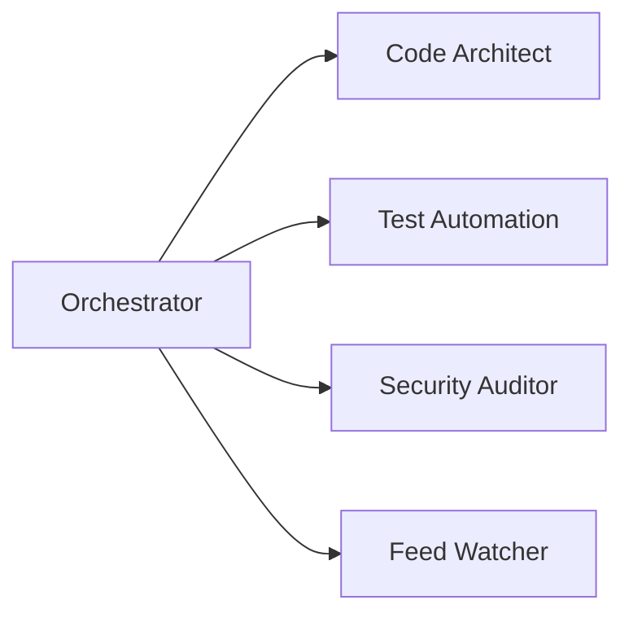

# Agents Index

This directory contains specialized agent documentation for the HELIX Discord Bot project. Each agent file outlines domain architecture, responsibilities, workflow loops, and execution commands.

## Available Agents

| Agent | Target Domain | Specification File |
|---|---|---|
| **orchestrator** | High-level planning, workflow management, task decomposition | [orchestrator.md](orchestrator.md) |
| **code-architect** | TypeScript ESM architecture, backend services, theme system | [code-architect.md](code-architect.md) |
| **test-automation** | Quality assurance, Vitest suite, mock servers, MSW | [test-automation.md](test-automation.md) |
| **security-auditor** | Secrets protection, vulnerability auditing, linting & formatting | [security-auditor.md](security-auditor.md) |
| **feed-watcher** | Feed polling, scraping, deduplication, Discord delivery | [feed-watcher.md](feed-watcher.md) |

## Related Domains

| Domain | Files | Purpose |
|---|---|---|
| Discord Delivery | `src/bot/*`, `src/webhook/discord.ts` | Direct Discord channel posting, slash commands |
| AppState | `src/state/*` | High-speed in-memory layer over SQLite; optional Redis coordinator |
| Persistence | `src/db/*` | `node:sqlite` database schema and repository |
| Auth & OAuth | `src/auth/*`, `src/oauth/*` | Discord OAuth login and session tokens |
| Dashboard UI | `src/dashboard/*` | Self-hosted Web UI with Light/Dark theme support |