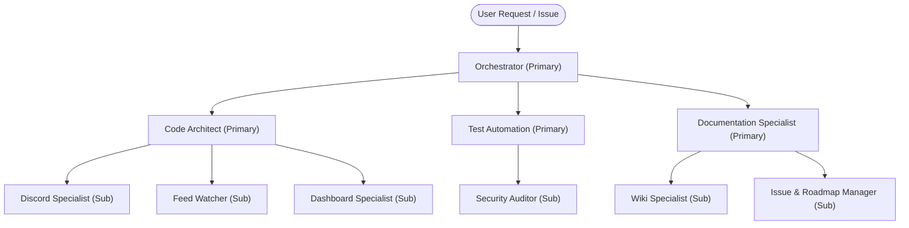

# Agent Ecosystem Catalog & Architecture

This directory defines the agent team for **HELIX Discord Bot**, organized as **primary agents** with **sub-agents** grouped by focus area. Each spec outlines responsibilities, domain architecture, constraints, and operational commands.

---

## Structure

```
.agents/agents/
├── orchestrator/                    # Coordination (primary)
├── engineering/                     # Project code (primary + sub-agents)
│   └── sub-agents/
├── quality/                         # Testing & security (primary + sub-agents)
│   └── sub-agents/
└── documentation/                   # wiki, md files, issues (primary + sub-agents)
    └── sub-agents/
```

Rules (`.agents/rules/`) bind all agents; templates (`.agents/templates/`) provide blueprints referenced by the relevant agents.

## Focus-Area Team Structure



---

## Primary Agents

| Agent | Focus Area | Core Focus | Specification |
|---|---|---|---|
| **Orchestrator** | Coordination | Task decomposition, primary-agent coordination, rollback, roadmap sync | [orchestrator/orchestrator.md](orchestrator/orchestrator.md) |
| **Code Architect** | Engineering | TypeScript ESM, SQLite write-through, HTTP dashboard, sub-agent ownership | [engineering/code-architect.md](engineering/code-architect.md) |
| **Test Automation** | Quality | Verification gate (`npm run check`), test harnesses, mock servers | [quality/test-automation.md](quality/test-automation.md) |
| **Documentation Specialist** | Documentation | wiki/, md files, issues, rule/skill/template sync | [documentation/documentation-specialist.md](documentation/documentation-specialist.md) |

## Sub-Agents

| Agent | Primary | Core Focus | Specification |
|---|---|---|---|
| **Discord Specialist** | Code Architect | discord.js v14 commands, events, EmbedHandler | [engineering/sub-agents/discord-specialist.md](engineering/sub-agents/discord-specialist.md) |
| **Feed Watcher** | Code Architect | RSS/Atom/Reddit, dedicated thread delivery, stream alerts | [engineering/sub-agents/feed-watcher.md](engineering/sub-agents/feed-watcher.md) |
| **Dashboard Specialist** | Code Architect | SSR dashboard, Discord OAuth2, theme | [engineering/sub-agents/dashboard-engineer.md](engineering/sub-agents/dashboard-engineer.md) |
| **Security Auditor** | Test Automation | Secrets, ESLint, formatting, dependencies | [quality/sub-agents/security-auditor.md](quality/sub-agents/security-auditor.md) |
| **Wiki Specialist** | Documentation Specialist | `wiki/`, README, `.env.example`, `.agents/` catalogs | [documentation/sub-agents/wiki-specialist.md](documentation/sub-agents/wiki-specialist.md) |
| **Issue & Roadmap Manager** | Documentation Specialist | GitHub issues, roadmaps, PRs, release notes | [documentation/sub-agents/issue-manager.md](documentation/sub-agents/issue-manager.md) |

---

## Subsystem Reference

| Subsystem | Source Location | Responsibility |
|---|---|---|
| **Discord Bot** | `src/bot/` | Discord client, slash commands, event handlers |
| **Modular Lib** | `src/bot/lib/` | Command options, EmbedHandler, feed helpers |
| **Dashboard** | `src/dashboard/` | Native HTTP server, Discord OAuth, REST API, SSR |
| **Persistence** | `src/db/` | `node:sqlite` tables, schema migrations |
| **State** | `src/state/` | In-memory `AppState`, entity definitions |
| **Feed Syndication** | `src/feed/` | XML parser, HTML scraper, free games, thread delivery |
| **Documentation** | `wiki/`, `README.md`, `AGENTS.md` | Wiki sync, `.env.example`, catalogs |
| **Issues & Roadmaps** | GitHub issues/PRs | Roadmap-first tracking, release notes |