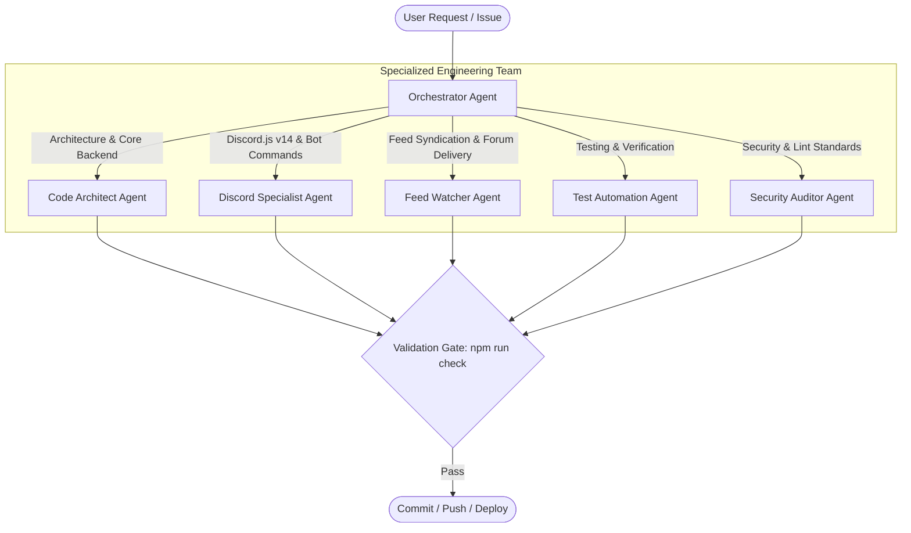

# Agent Team Catalog & Architecture

This directory defines the specialized agent team for **HELIX Discord Bot**. Each agent specification outlines responsibilities, domain architecture, constraints, and operational commands.

---

## Multi-Agent Team Structure

---

## Agent Directory

| Agent | Target Domain | Core Focus | Specification |
|---|---|---|---|
| **Orchestrator** | Project & Workflow Management | Task decomposition, roadmap execution, permission gates, rollback coordination | [orchestrator.md](orchestrator.md) |
| **Code Architect** | Backend & System Design | TypeScript ESM architecture, SQLite write-through state, HTTP dashboard | [code-architect.md](code-architect.md) |
| **Discord Specialist** | Discord.js v14 & Bot Engineering | Slash commands, modular `lib/options/`, events, EmbedHandler, voice gateway | [discord-specialist.md](discord-specialist.md) |
| **Feed Watcher** | Feed Syndication & Delivery | RSS/Atom/Reddit ingestion, weekly Sunday free games, single-thread forum delivery | [feed-watcher.md](feed-watcher.md) |
| **Dashboard Specialist** | Dashboard & Discord Integration | Zero-frontend-dep SSR, Discord OAuth2, guild admin authorization, EmbedHandler parity | [dashboard-engineer.md](dashboard-engineer.md) |
| **Test Automation** | Quality Assurance | Verification gate (`npm run check`), test harnesses, mock servers | [test-automation.md](test-automation.md) |
| **Security Auditor** | Security & Code Quality | Secrets protection, zero unsolicited injection, ESLint compliance | [security-auditor.md](security-auditor.md) |

---

## Subsystem Reference

| Subsystem | Source Location | Responsibility |
|---|---|---|
| **Discord Bot** | `src/bot/` | Discord client, slash commands, event handlers, voice connector |
| **Modular Lib** | `src/bot/lib/` | Command options, EmbedHandler, music formatting, admin permissions |
| **Dashboard** | `src/dashboard/` | Native HTTP server, Discord OAuth, REST API, SSR dashboard |
| **Persistence** | `src/db/` | `node:sqlite` tables, schema migrations, write-through repository |
| **State** | `src/state/` | In-memory `AppState`, entity definitions, `ioredis-mock` locks |
| **Feed Syndication** | `src/feed/` | XML parser, HTML scraper, free games, single-thread forum delivery |