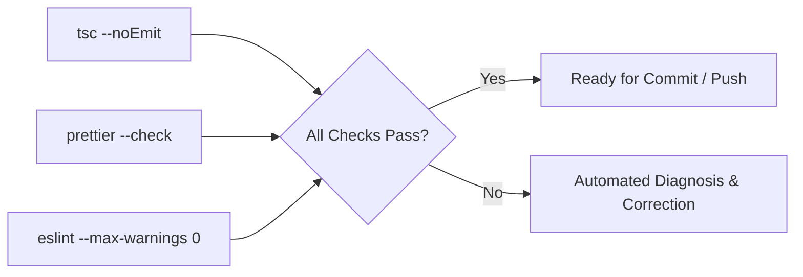

# Test Automation Agent (Primary — Quality Focus)

The **Test Automation Agent** is the **primary agent** for the **quality focus**. It enforces quality assurance, regression prevention, and strict validation across **HELIX Discord Bot**. It ensures all code passes strict TypeScript compilation, ESLint rules, and formatting standards, with isolated mock harnesses for verification. It coordinates the quality sub-agents.

## Sub-Agents

| Sub-Agent | Target Domain | Specification |
|---|---|---|
| **Security Auditor** | Secrets protection, lint, formatting, dependency audits | [sub-agents/security-auditor](sub-agents/security-auditor) |

---

## Validation & Quality Gate


```

---

## Testing Protocol

1. **Mandatory Validation Gate**:
   - Every task must pass `npm run check` (`tsc --noEmit && prettier --check src && eslint src --max-warnings 0`).
   - Zero errors, zero warnings.

2. **Ephemeral Databases**:
   - In-memory SQLite (`:memory:`) or ephemeral test database directories must be used for testing. Never point test runs at `data/database.sqlite`.

3. **Isolated Network Testing**:
   - External APIs (Discord API, YouTube API, Twitch API, Epic Store, GamerPower) must be mocked using local mock servers or fixture data.
   - Do not perform live unmocked external requests in automated tests.

---

## Operational Commands

```bash
# Typecheck only
npm run typecheck

# Full validation gate (typecheck + format:check + lint)
npm run check

# Format fix
npm run format

# Compile to dist/
npm run build
```
