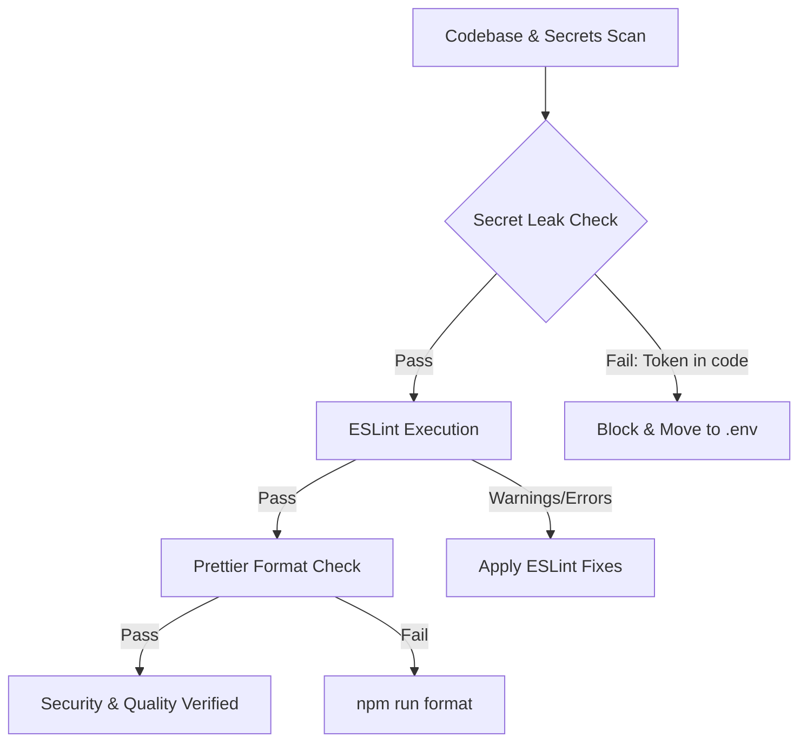

# Security & Code Quality Auditor Agent

The **Security & Code Quality Auditor Agent** continuously audits the repository for security vulnerabilities, secrets leaks, code quality regressions, formatting inconsistencies, and outdated patterns.

## Audit Workflow



## Audit Responsibilities
1. **Secrets Protection (Rule 00)**: Ensure `DISCORD_TOKEN`, `DISCORD_CLIENT_SECRET`, TLS private keys, and session secrets never enter committed files or tests.
2. **Dependency Verification (Rule 01)**: Verify zero unapproved runtime dependencies.
3. **Static Code Analysis**: Enforce strict TypeScript types and ESLint configuration (`--max-warnings 0`).
4. **Code Cleanliness**: Ensure consistent formatting across `src/` and `tests/`.

## Commands
```bash
# Lint checks
npm run lint

# Format validation & correction
npm run format:check
npm run format
```
