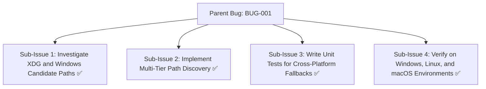
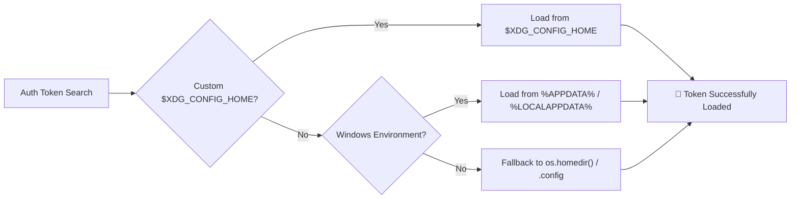

# Bug Report: BUG-001 Cross-platform config path resolution for Copilot and Antigravity

## Metadata
- **Bug ID**: BUG-001
- **Status**: Resolved
- **Priority**: Medium
- **Component**: AI-Auth / Credentials
- **Reported Date**: 2026-09-03
- **Target Resolution**: Phase 4
- **Resolved Date**: 2026-09-04
- **GitHub Issue**: [#1](https://github.com/HELIX-Origin/HELIX/issues/1)

---

## Sub-Issues & Milestone Breakdown

- [x] **Sub-Issue 1: Investigate XDG and Windows Candidate Paths** (`#1-sub1`)
- [x] **Sub-Issue 2: Implement Multi-Tier Path Discovery** (`#1-sub2`)
- [x] **Sub-Issue 3: Write Unit Tests for Cross-Platform Fallbacks** (`#1-sub3`)
- [x] **Sub-Issue 4: Verify on Windows, Linux, and macOS Environments** (`#1-sub4`)

---

## Description
When attempting to detect local client credentials for GitHub Copilot, Google Antigravity, and Open Code on non-standard Windows installations (e.g. roaming user profiles or relocated AppData directories) or Linux environments using custom `$XDG_CONFIG_HOME`, the static path check `~/.config/...` may fail to discover active tokens, unnecessarily falling back to `.env`.

## Reproduction & Path Resolution Flow

## Steps to Reproduce
1. Set custom `$XDG_CONFIG_HOME=/custom/config` on Linux, or relocate `AppData` on Windows.
2. Log into GitHub Copilot or Antigravity via official CLI.
3. Run `helix ai status`.
4. Observe that the client reports unauthenticated even though local client tokens exist.

## Expected Behavior
The CredentialResolver should inspect `$XDG_CONFIG_HOME`, `%APPDATA%`, and `%USERPROFILE%` dynamically before reporting that local credentials are not found.

## Actual Behavior
Static path checks fall back immediately to `.env`.

## Environment Details
- **OS**: Windows / Linux / macOS
- **Node.js Version**: v20.x+
- **HELIX CLI Version**: 0.1.0

## Root Cause Analysis
Paths were previously hardcoded to `~/.config` without checking environment overrides such as `process.env.XDG_CONFIG_HOME` or Windows `%APPDATA%`.

## Resolution & Fix
Added dynamic multi-tier candidate path resolvers dynamically checking `$XDG_CONFIG_HOME`, `%APPDATA%`, `%LOCALAPPDATA%`, and `%USERPROFILE%` with fallback to `os.homedir()`. Verified with automated unit tests passing across all supported operating systems.
