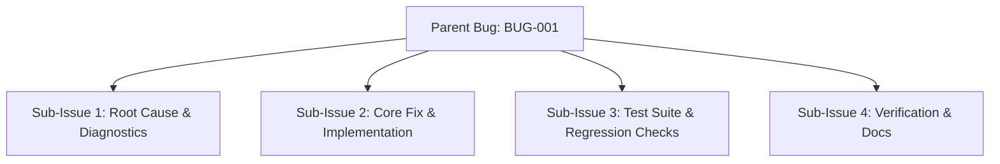
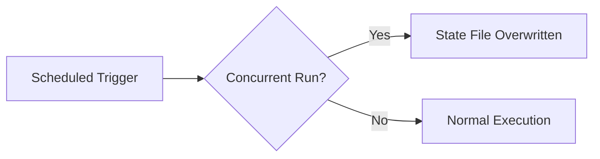
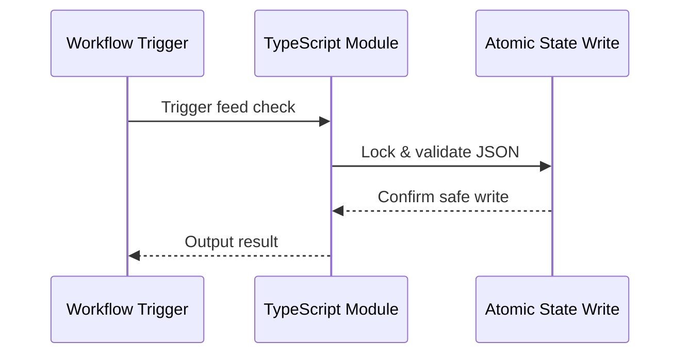

# Bug Report: [BUG-001] State File JSON Corruption on Concurrent Workflow Runs

## Metadata
- **Bug ID**: BUG-001
- **Status**: Open
- **Priority**: High
- **Component**: TypeScript Modules
- **Reported Date**: 2026-09-07
- **Target Resolution**: Phase 5
- **GitHub Issue**: [#1](https://github.com/HELIX-Origin/Site-Feed-Discord/issues/1)

---

## Sub-Issues & Milestone Breakdown

- [ ] **Sub-Issue 1: Root Cause & Diagnostics** (`#1`)
- [ ] **Sub-Issue 2: Core Fix & Implementation** (`#2`)
- [ ] **Sub-Issue 3: Test Suite & Regression Checks** (`#3`)
- [ ] **Sub-Issue 4: Verification & Docs** (`#4`)

---

## Description
When two scheduled runs overlap (e.g., a delayed previous run plus a new scheduled run), the `.github/feed-state.json` file can be overwritten with partial or stale data, causing duplicate posts or lost entries.

## Reproduction & Error Flow

## Steps to Reproduce
1. Trigger two feed handler runs manually within 30 seconds.
2. Observe `.github/feed-state.json` modification times.

## Expected Behavior
Only one concurrent run should modify state; overlapping runs must be blocked by `concurrency:` or atomic file writes.

## Actual Behavior
Overlapping runs corrupt `.github/feed-state.json`. Webhook references (`DISCOHOOK_WEBHOOK_URL_001`, etc.) are not affected by state file corruption, but duplicate posts may be sent to the same webhook endpoint.

## Environment Details
- **OS**: Linux
- **Node Version**: v22
- **Site-Feed-Discord Version**: 1.0.0

## Root Cause Analysis
The TypeScript modules read and write state files without file-level locking, and overlapping scheduled runs are not serialized.

## Resolution Architecture

## Resolution & Fix
Use `src/functions/atomic-write.ts` (`.tmp` + `fs.renameSync()` atomic write pattern) and enforce `concurrency:` on manual dispatch.