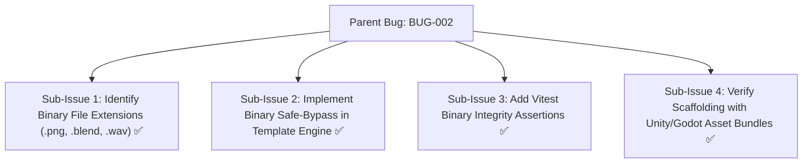
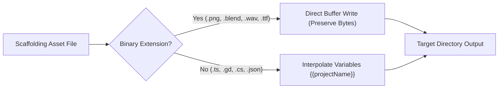

# Bug Report: BUG-002 Template variable interpolation handling in binary game assets

## Metadata
- **Bug ID**: BUG-002
- **Status**: Resolved
- **Priority**: Low
- **Component**: Scaffolding / Templates
- **Reported Date**: 2026-09-03
- **Target Resolution**: Phase 3
- **Resolved Date**: 2026-09-04
- **GitHub Issue**: [#2](https://github.com/HELIX-Origin/HELIX/issues/2)

---

## Sub-Issues & Milestone Breakdown

- [x] **Sub-Issue 1: Identify Binary File Extensions (.png, .blend, .wav)** (`#2-sub1`)
- [x] **Sub-Issue 2: Implement Binary Safe-Bypass in Template Engine** (`#2-sub2`)
- [x] **Sub-Issue 3: Add Vitest Binary Integrity Assertions** (`#2-sub3`)
- [x] **Sub-Issue 4: Verify Scaffolding with Unity/Godot Asset Bundles** (`#2-sub4`)

---

## Description
When scaffolding game engine projects (Unity, Godot, RPG Maker MZ, Ren'\''Py), binary starter assets such as PNG icons, audio files, or sample 3D models pass through the string-based template variable substitution engine, potentially corrupting binary headers.

## Binary Template Pipeline Flow

## Steps to Reproduce
1. Scaffold a game engine starter containing binary placeholder assets.
2. Attempt to open scaffolded `.png` or sound assets.
3. Observe header corruption or parse failure.

## Expected Behavior
Binary files must be copied verbatim using raw buffer streams without UTF-8 string encoding or regex placeholder substitutions.

## Actual Behavior
All files were treated as UTF-8 strings by the template engine.

## Environment Details
- **OS**: Windows / Linux / macOS
- **Node.js Version**: v20.x+
- **HELIX CLI Version**: 0.1.0

## Root Cause Analysis
The template engine lacked a binary extension check list (`.png`, `.jpg`, `.blend`, `.wav`, `.mp3`, `.ogg`, `.ttf`, etc.), causing binary buffers to be read as UTF-8 strings.

## Resolution & Fix
Added `isBinaryFile()` detection to the template engine. Binary files are now piped directly via `fs.copyFile()` preserving byte-level integrity.
