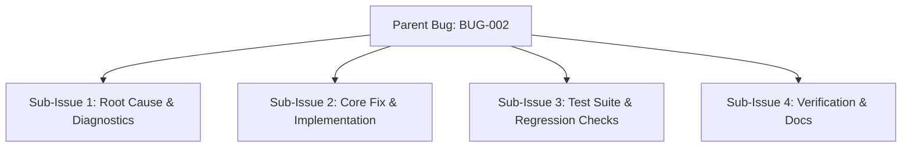
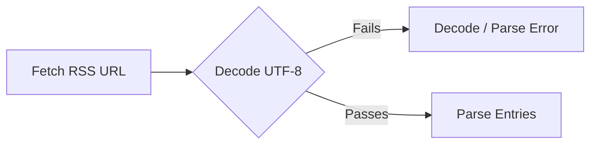
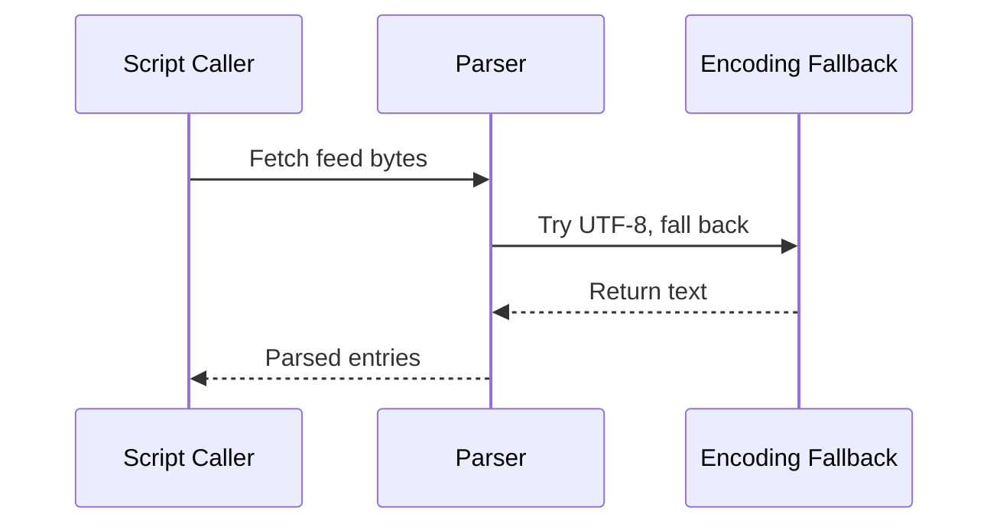

# Bug Report: [BUG-002] Feed Parser Fails on Non-UTF-8 RSS Content

## Metadata
- **Bug ID**: BUG-002
- **Status**: Investigating
- **Priority**: Medium
- **Component**: TypeScript Modules / Feed Parser
- **Reported Date**: 2026-09-07
- **Target Resolution**: Phase 2
- **GitHub Issue**: [#2](https://github.com/HELIX-Origin/Site-Feed-Discord/issues/2)

---

## Sub-Issues & Milestone Breakdown

- [ ] **Sub-Issue 1: Root Cause & Diagnostics** (`#5`)
- [ ] **Sub-Issue 2: Core Fix & Implementation** (`#6`)
- [ ] **Sub-Issue 3: Test Suite & Regression Checks** (`#7`)
- [ ] **Sub-Issue 4: Verification & Docs** (`#8`)

---

## Description
When an RSS feed contains non-UTF-8 encoded characters (e.g., legacy forum posts with ISO-8859-1 encoding), `fetch()` may return bytes that cause `TextDecoder('utf-8')` to produce replacement characters or the parser to raise an error.

## Reproduction & Error Flow

## Steps to Reproduce
1. Configure `SITE_URL` to a legacy forum with ISO-8859-1 RSS output.
2. Run `npm start` (feed handler) manually.
3. Observe broken characters or a parse failure in the feed entries.

## Expected Behavior
The parser should attempt UTF-8 first, fall back to `latin1`, and log a warning rather than crash.

## Actual Behavior
Feed parsing fails or produces mangled output, stopping the run and producing no Discord posts.

## Environment Details
- **OS**: Linux
- **Node Version**: v22
- **Site-Feed-Discord Version**: 1.0.0

## Resolution Architecture

## Resolution & Fix
Implement a safe decode loop: attempt UTF-8 first, fall back to `latin1` (`TextDecoder('utf-8', { fatal: false })` or explicit fallback), with logging of the chosen encoding.