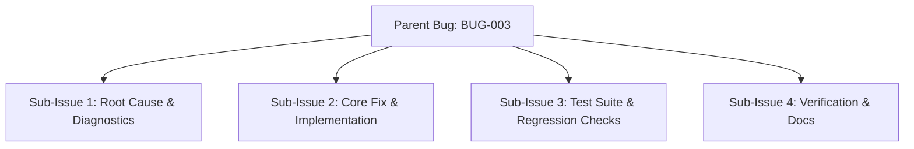
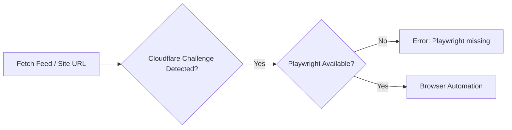
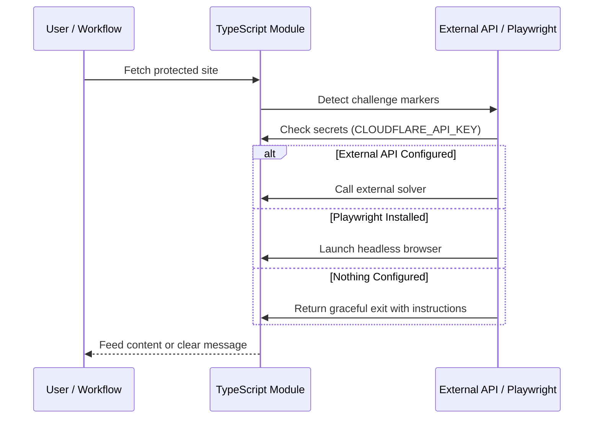

# Bug Report: [BUG-003] Cloudflare Challenge Bypass Fails When Playwright Not Installed

## Metadata
- **Bug ID**: BUG-003
- **Status**: Open
- **Priority**: High
- **Component**: TypeScript Modules / External API
- **Reported Date**: 2026-09-07
- **Target Resolution**: Phase 3
- **GitHub Issue**: [#3](https://github.com/HELIX-Origin/Site-Feed-Discord/issues/3)

---

## Sub-Issues & Milestone Breakdown

- [ ] **Sub-Issue 1: Root Cause & Diagnostics** (`#9`)
- [ ] **Sub-Issue 2: Core Fix & Implementation** (`#10`)
- [ ] **Sub-Issue 3: Test Suite & Regression Checks** (`#11`)
- [ ] **Sub-Issue 4: Verification & Docs** (`#12`)

---

## Description
When the target `SITE_URL` is behind a Cloudflare challenge (`cf-challenge`, `managed challenge`), the browser-automation path attempts to use `playwright`. If `playwright` is not installed or the runtime lacks a browser binary, the script raises an unhandled error instead of attempting an external challenge-solving API or providing a graceful fallback.

## Reproduction & Error Flow

## Steps to Reproduce
1. Set `SITE_URL` to a domain protected by Cloudflare (`cf-turnstile`).
2. Run `npm start` without `playwright` installed.
3. Observe an unhandled error from the browser-automation path.

## Expected Behavior
If `playwright` is unavailable, the agent should check for an optional external challenge-solving API configured via **secrets / `.env`** (`CLOUDFLARE_API_KEY` or `CHALLENGE_SOLVER_URL`), attempt to solve via that service, and fall back to native `fetch` with a clear warning message. If no external service is configured, the script should exit cleanly with a message instructing the user to either install `playwright` or configure an external API.

## Actual Behavior
Script exits with an unhandled exception, providing no path for users who prefer external APIs over browser automation.

## Environment Details
- **OS**: Linux / macOS / Windows
- **Node Version**: v22
- **Playwright Installed**: No
- **Site-Feed-Discord Version**: 1.0.0

## Root Cause Analysis
The browser-automation path assumes `playwright` is the only resolution mechanism. There is no branch for external APIs or graceful degradation when the dependency is missing.

## Resolution Architecture

## Resolution & Fix
- Add optional `CLOUDFLARE_API_KEY` and `CHALLENGE_SOLVER_URL` environment variables.
- Modify the browser-automation path to try external API first (if configured), then `playwright`, then graceful exit.
- Update `.agents/skills/cloudflare.md` with external API configuration examples.
- Update `.agents/rules/zero-unsolicited-injection.md` to document permitted external APIs.