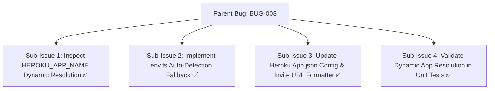
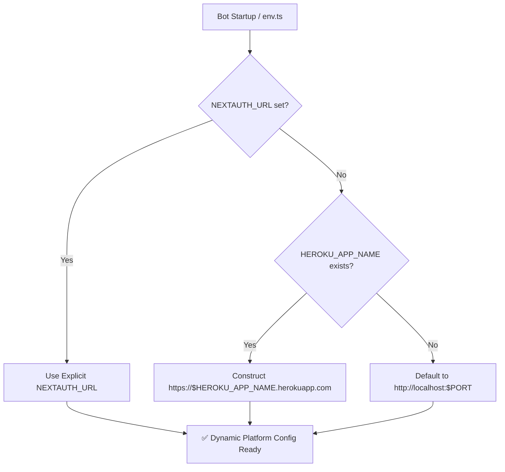

# Bug Report: BUG-003 Heroku deployment fails to auto-detect dynamic app URLs and bot invite URL

## Metadata
- **Bug ID**: BUG-003
- **Status**: Resolved
- **Priority**: High
- **Component**: Deployment / Environment
- **Reported Date**: 2026-09-04
- **Target Resolution**: Phase 6
- **Resolved Date**: 2026-09-04
- **GitHub Issue**: [#3](https://github.com/HELIX-Origin/HELIX/issues/3)

---

## Sub-Issues & Milestone Breakdown

- [x] **Sub-Issue 1: Inspect HEROKU_APP_NAME Dynamic Resolution** (`#3-sub1`)
- [x] **Sub-Issue 2: Implement env.ts Auto-Detection Fallback** (`#3-sub2`)
- [x] **Sub-Issue 3: Update Heroku App.json Config & Invite URL Formatter** (`#3-sub3`)
- [x] **Sub-Issue 4: Validate Dynamic App Resolution in Unit Tests** (`#3-sub4`)

---

## Description
When deploying HELIX to Heroku, `NEXTAUTH_URL`, `DISCORD_CALLBACK_URL`, and `NEXT_PUBLIC_INVITE_URL` required manual specification even though Heroku dynos provide `HEROKU_APP_NAME` dynamically. Missing values caused OAuth2 authentication callbacks to fail.

## Dynamic Environment Resolution Architecture

## Steps to Reproduce
1. Deploy HELIX to Heroku without specifying `NEXTAUTH_URL`.
2. Access the dashboard login endpoint.
3. OAuth2 redirects to an invalid localhost callback instead of the Heroku domain.

## Expected Behavior
The environment configuration module should automatically construct the correct URLs from `HEROKU_APP_NAME` when explicit URLs are not provided.

## Actual Behavior
The system threw an error or defaulted to `http://localhost:5000`.

## Environment Details
- **OS**: Heroku Eco / Linux
- **Node.js Version**: v22.x
- **HELIX Version**: 1.0.0

## Root Cause Analysis
`env.ts` did not inspect `process.env.HEROKU_APP_NAME` to synthesize the canonical application URL.

## Resolution & Fix
Updated `src/env.ts` to inspect `HEROKU_APP_NAME`, `RENDER_EXTERNAL_URL`, and `RAILWAY_PUBLIC_DOMAIN` with automatic derivation of OAuth2 and callback endpoints.
