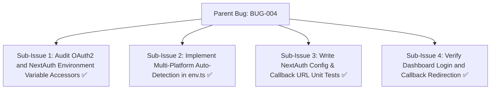
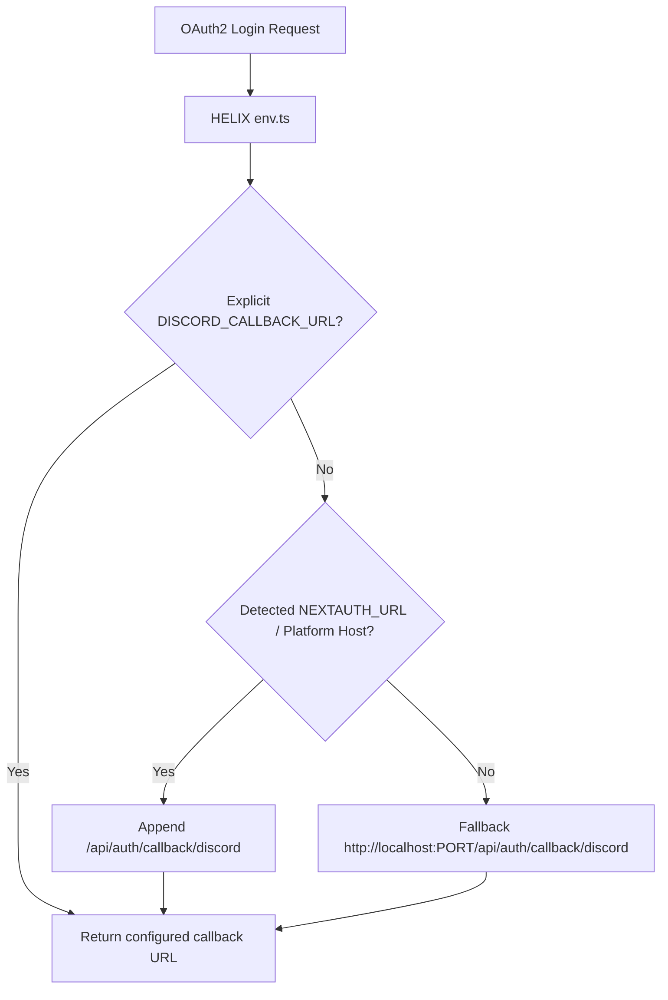

# Bug Report: BUG-004 Auto-resolve NEXTAUTH_URL and callback URLs from platform detection

## Metadata
- **Bug ID**: BUG-004
- **Status**: Resolved
- **Priority**: Medium
- **Component**: Discord Bot / Dashboard / Env
- **Reported Date**: 2026-09-04
- **Target Resolution**: Phase 7
- **Resolved Date**: 2026-09-04
- **GitHub Issue**: [#9](https://github.com/HELIX-Origin/HELIX/issues/9)

---

## Sub-Issues & Milestone Breakdown

- [x] **Sub-Issue 1: Audit OAuth2 and NextAuth Environment Variable Accessors** (`#9-sub1`)
- [x] **Sub-Issue 2: Implement Multi-Platform Auto-Detection in env.ts** (`#9-sub2`)
- [x] **Sub-Issue 3: Write NextAuth Config & Callback URL Unit Tests** (`#9-sub3`)
- [x] **Sub-Issue 4: Verify Dashboard Login and Callback Redirection** (`#9-sub4`)

---

## Description
During the transition to the standalone Discord bot architecture, `NEXTAUTH_URL`, `NEXTAUTH_INTERNAL_URL`, and `DISCORD_CALLBACK_URL` were required manually in `.env`. When running behind reverse proxies or container hosting platforms, missing configuration led to OAuth2 redirect mismatches.

## Auto-Resolution Architecture

## Steps to Reproduce
1. Start the bot with only `DISCORD_TOKEN`, `DISCORD_CLIENT_ID`, and `DISCORD_CLIENT_SECRET`.
2. Omit `DISCORD_CALLBACK_URL` and `NEXTAUTH_URL`.
3. Try to authenticate via Discord OAuth2.

## Expected Behavior
`getDiscordCallbackUrl()` automatically resolves `http(s)://<host>:<port>/api/auth/callback/discord` based on the detected app URL.

## Actual Behavior
Threw an error indicating missing callback URL or redirected to an unconfigured URL.

## Environment Details
- **OS**: Windows / Linux / macOS
- **Node.js Version**: v22.x
- **HELIX Version**: 1.0.0

## Root Cause Analysis
Helper functions did not have safe automatic fallback construction for NextAuth and OAuth2 callback endpoints.

## Resolution & Fix
Refactored `src/env.ts` with getters `getAppUrl()`, `getNextAuthUrl()`, and `getDiscordCallbackUrl()`. Created unit test suite `tests/unit/nextauth-config.test.ts` (6/6 tests passing).
