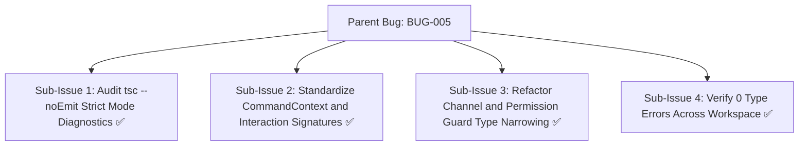
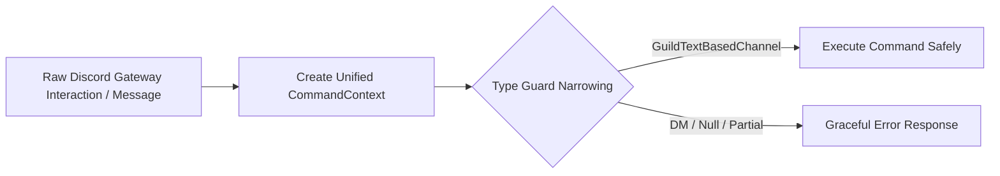

# Bug Report: BUG-005 TypeScript strict mode errors after discord.js vanilla migration

## Metadata
- **Bug ID**: BUG-005
- **Status**: Resolved
- **Priority**: High
- **Component**: Discord Bot / TypeScript
- **Reported Date**: 2026-09-04
- **Target Resolution**: Phase 7
- **Resolved Date**: 2026-09-04
- **GitHub Issue**: [#10](https://github.com/HELIX-Origin/HELIX/issues/10)

---

## Sub-Issues & Milestone Breakdown

- [x] **Sub-Issue 1: Audit tsc --noEmit Strict Mode Diagnostics** (`#10-sub1`)
- [x] **Sub-Issue 2: Standardize CommandContext and Interaction Signatures** (`#10-sub2`)
- [x] **Sub-Issue 3: Refactor Channel and Permission Guard Type Narrowing** (`#10-sub3`)
- [x] **Sub-Issue 4: Verify 0 Type Errors Across Workspace** (`#10-sub4`)

---

## Description
Following the migration from framework wrappers to vanilla `discord.js v14`, running `npm run typecheck` produced strict TypeScript compiler errors regarding nullable channel types, union permission checks, and CommandContext parameter types.

## Type Narrowing Architecture

## Steps to Reproduce
1. Run `npm run typecheck` or `npm --prefix HELIX run typecheck`.
2. Observe multiple TypeScript compilation errors in command handlers and interactions.

## Expected Behavior
Clean TypeScript compilation with 0 errors under `strict: true`.

## Actual Behavior
Multiple TS2322 and TS2345 errors during type verification.

## Environment Details
- **OS**: Windows / Linux / macOS
- **Node.js Version**: v22.x
- **TypeScript Version**: 5.x

## Root Cause Analysis
Discord.js v14 strongly distinguishes text-based guild channels from thread channels and voice channels. Handlers assumed `interaction.channel` was always `TextChannel` without explicit type guards.

## Resolution & Fix
Implemented explicit type narrowing and unified `CommandContext` across all 25 commands. Verified `npm run typecheck` and `npm run test:types` complete with 0 errors.
