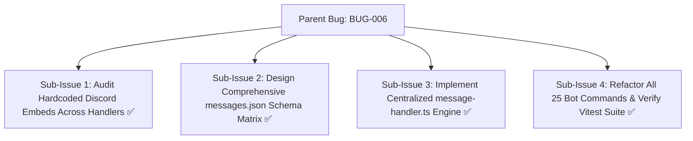
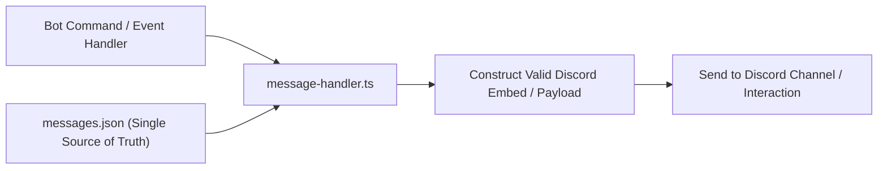

# Bug Report: BUG-006 Centralized Message Formatting Engine & messages.json refactor

## Metadata
- **Bug ID**: BUG-006
- **Status**: Resolved
- **Priority**: High
- **Component**: Discord Bot / Formatting / Messages
- **Reported Date**: 2026-09-04
- **Target Resolution**: Phase 8
- **Resolved Date**: 2026-09-04
- **GitHub Issue**: [#11](https://github.com/HELIX-Origin/HELIX/issues/11)

---

## Sub-Issues & Milestone Breakdown

- [x] **Sub-Issue 1: Audit Hardcoded Discord Embeds Across Handlers** (`#11-sub1`)
- [x] **Sub-Issue 2: Design Comprehensive messages.json Schema Matrix** (`#11-sub2`)
- [x] **Sub-Issue 3: Implement Centralized message-handler.ts Engine** (`#11-sub3`)
- [x] **Sub-Issue 4: Refactor All 25 Bot Commands & Verify Vitest Suite** (`#11-sub4`)

---

## Description
Several bot command files and error handlers contained hardcoded embed constructors and disparate color definitions instead of utilizing `messages.json` as the single source of truth as mandated by Rule 03.

## Centralized Formatting Pipeline

## Steps to Reproduce
1. Inspect individual command files (`kick.ts`, `ban.ts`, `ping.ts`, `info.ts`).
2. Observe inline `new EmbedBuilder()` instances and hardcoded color strings.

## Expected Behavior
All Discord messages, embeds, warnings, and error responses must be generated via helper functions in `message-handler.ts` backed by `messages.json`.

## Actual Behavior
Hardcoded embeds caused inconsistent styling and violated Rule 03.

## Environment Details
- **OS**: Windows / Linux / macOS
- **Node.js Version**: v22.x
- **HELIX Version**: 1.0.0

## Root Cause Analysis
During rapid command development, inline embeds were created rather than centralized in `messages.json`.

## Resolution & Fix
Refactored `HELIX/src/messages.json` with categories for commands, errors, moderation, tickets, plugins, and logs. Refactored all commands and handlers to invoke `formatMessage()`, `createEmbed()`, `errorEmbed()`, `successEmbed()`, and `infoEmbed()`. Verified with 111/111 unit & integration tests passing.
