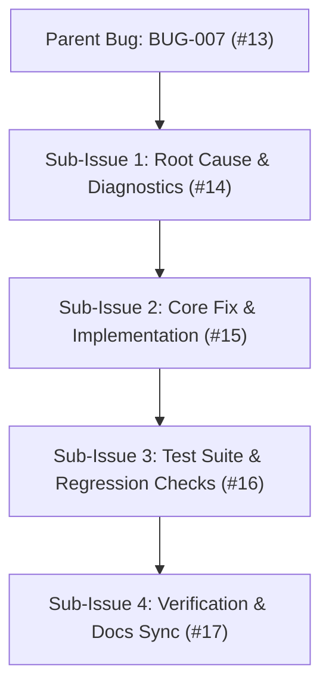
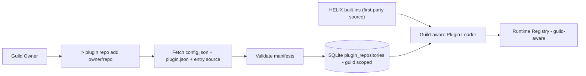

# Bug Report: BUG-007 Plugin repositories cloned to filesystem instead of stored in database

## Metadata
- **Bug ID**: BUG-007
- **Status**: Open
- **Priority**: High
- **Component**: Plugins
- **Reported Date**: 2026-09-04
- **Target Resolution**: Phase 8 / Phase 9 correction
- **GitHub Issue**: [#13](https://github.com/HELIX-Origin/HELIX-Discord-Bot/issues/13)

---

## Sub-Issues & Milestone Breakdown

- [ ] **Sub-Issue 1: Root Cause & Diagnostics** ([#14](https://github.com/HELIX-Origin/HELIX-Discord-Bot/issues/14)) — Audit clone-to-disk flow; define DB schema + sandboxed entry execution contract.
- [ ] **Sub-Issue 2: Core Fix & Implementation** ([#15](https://github.com/HELIX-Origin/HELIX-Discord-Bot/issues/15)) — DB-backed, guild-scoped loader/registry; sandboxed executor; reworked `>plugin` command; remove community dir flow.
- [ ] **Sub-Issue 3: Test Suite & Regression Checks** ([#16](https://github.com/HELIX-Origin/HELIX-Discord-Bot/issues/16)) — Unit + integration tests for DB storage, per-guild scoping, sandboxed execution, and zero filesystem writes.
- [ ] **Sub-Issue 4: Verification & Docs Sync** ([#17](https://github.com/HELIX-Origin/HELIX-Discord-Bot/issues/17)) — Update plans/docs; resolve and close.

---

## Description
The plugin engine installs community plugins by `git clone`-ing a GitHub repository into `HELIX/src/plugins/community/<repo>/` and importing entry `.ts` files from disk into a global registry. This is a design mis-sight: plugin repositories should be stored in the database as the source of truth with per-guild scoping, never downloaded into the bot filesystem.

## Target Architecture

## Design Decisions
1. Built-in `helix-origin` plugins stay as first-party source code on disk (trusted core).
2. Imported / community / custom repos stored entirely in the database (`config.json`, `plugin.json` manifests, entry source text).
3. Per-guild rows (`guild_id` nullable); repos without a guild are global.
4. Entry code executes via sandboxed evaluation of stored source (no disk materialization).
5. `>plugin` command reworked: `list`, `install`, `remove`, `info`, `enable`, `disable`, plus per-guild `repo add` / `repo list` / `repo remove`.
6. The `git clone` install flow and `HELIX/src/plugins/community/` directory are removed.

## Steps to Reproduce
1. Run `>plugin install owner/repo`.
2. The bot `git clone`s the repository into `HELIX/src/plugins/community/`.
3. Plugins are registered globally with no per-guild scoping.
4. A guild owner has no way to manage a repo scoped only to their guild.

## Expected Behavior
- No plugin content is downloaded into the bot filesystem.
- Plugin repos stored in the database with optional `guild_id` scoping.
- Entries execute via sandboxed evaluation of stored source.
- Guild owners can add/list/remove their own repos within their guild.

## Actual Behavior
- `git clone` into `HELIX/src/plugins/community/<repo>/`.
- Entry `.ts` files imported from disk; global registry only; no per-guild repos.

## Environment Details
- **OS**: Windows / Linux / macOS
- **Node.js Version**: v22.x
- **HELIX Version**: 1.0.0

## Root Cause Analysis
The plugin engine was implemented to load from the repository tree rather than from the database, and per-guild repo scoping was never specified in the original plugin system design (Phase 8 / Phase 9). This issue tracks correcting the implementation to the intended DB-backed, guild-scoped model.

## Resolution & Fix
*(To be filled once resolved with PR or commit reference.)*