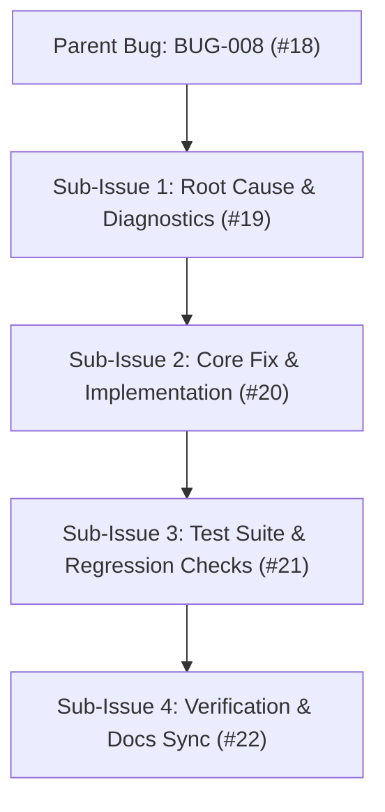
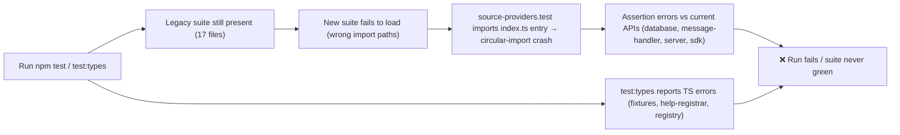
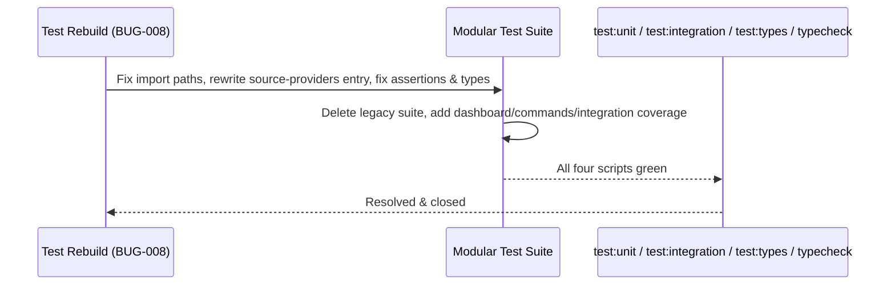

# Bug Report: BUG-008 Test suite rebuild incomplete — legacy Vitest suite still active, new modular suite broken

## Metadata
- **Bug ID**: BUG-008
- **Status**: Resolved
- **Priority**: High
- **Component**: Testing
- **Reported Date**: 2026-09-04
- **Target Resolution**: Post-Phase-7 test infrastructure correction
- **GitHub Issue**: [#18](https://github.com/HELIX-Origin/HELIX-Discord-Bot/issues/18)

---

## Sub-Issues & Milestone Breakdown

- [ ] **Sub-Issue 1: Root Cause & Diagnostics** ([#19](https://github.com/HELIX-Origin/HELIX-Discord-Bot/issues/19)) — Full failure inventory + root-cause writeup; dictated fix per failing file; deletion list + missing coverage list.
- [ ] **Sub-Issue 2: Core Fix & Implementation** ([#20](https://github.com/HELIX-Origin/HELIX-Discord-Bot/issues/20)) — Fix import paths, rewrite source-providers entry, fix assertions/determinism, fix test:types errors.
- [ ] **Sub-Issue 3: Test Suite & Regression Checks** ([#21](https://github.com/HELIX-Origin/HELIX-Discord-Bot/issues/21)) — Delete 17 legacy files + stale fixtures/README; add dashboard + commands/metadata units; integration suites.
- [ ] **Sub-Issue 4: Verification & Docs Sync** ([#22](https://github.com/HELIX-Origin/HELIX-Discord-Bot/issues/22)) — test:unit, test:integration, test:types, typecheck green; docs synced; resolve & close.

---

## Description
The repository migrated to a new modular Vitest suite under `tests/` (unit subfolders for `db`, `env`, `handlers`, `plugins`, `plugins/sdk`, `scaffolding`, `server`, `utils`; plus `tests/fixtures/` and `tests/helpers/`, `vitest.config.ts`, `tsconfig.test.json`, and root `package.json` scripts `test:unit`, `test:integration`, `test:types`, `typecheck`). The rebuild is incomplete: 17 legacy test files from before the discord.js-vanilla and messages.json refactors are still present, and the new suite ships with broken import paths, a circular-import crash in the SDK source-provider tests, assertion drift against current APIs, and TypeScript type errors. `npm test` currently mixes old and new suites, and runs are failing.

## Reproduction & Error Flow

## Steps to Reproduce
1. Run `npm test` — old and new suites run together; multiple failures.
2. Run `npm run test:types` — TS errors in `tests/fixtures/template-files.ts`, `tests/unit/env/env.test.ts`, `tests/unit/handlers/help-registrar.test.ts`, `tests/unit/plugins/registry.test.ts`.
3. Run `npx vitest run tests/unit/plugins/sdk/source-providers.test.ts` — `TypeError: registerBuiltInSourceProviders is not a function` from the `source-providers/index.ts` ↔ `source-resolver.ts` ↔ `github.ts` circular import.
4. `npm run typecheck` — green (source compiles; only the test layer is broken).

## Expected Behavior
- A single, self-contained, green test suite under `tests/` covering bot core, plugins/sdk, scaffolding, dashboard, and events via `test:unit`, `test:integration`, `test:types`, and `typecheck`.
- No legacy test files referencing pre-refactor APIs.

## Actual Behavior
- 17 legacy files still in `tests/unit` and `tests/integration`; new suite fails to load or crashes (`tests/unit/env`, 3× `tests/unit/scaffolding`, `tests/unit/plugins/sdk/source-resolver` wrong fixture path; `source-providers` cycle crash).
- Assertion drift: `getUserActiveTicket` returns first inserted row (no `ORDER BY`), message-handler uses embed-object keys instead of `.embed.description`, `resolveBotInviteUrl` fallback leaks the real `DISCORD_CLIENT_ID` from `.env`, Java NPE stack-trace fixture lacks a message after the exception, snippet-builder generic fallback capitalizes the model name.
- `test:types` errors in 4 files; missing coverage for dashboard (`auth-config`, `auth-handlers`, `router`, `html`) and `commands/metadata`; no integration suites for commands-load, plugin-loader, scaffold e2e, dashboard-api, or events.

## Environment Details
- **OS**: Windows
- **Node.js Version**: v22.x
- **HELIX Version**: 1.0.0
- **Test Runner**: Vitest v2.1.9

## Root Cause Analysis
The new modular test suite was added while the legacy suite was never removed, and the new files were authored with import/assertion assumptions that drifted from the current source APIs after the discord.js-vanilla migration, the `messages.json` refactor, and the plugin SDK rework. The `source-providers/index.ts` module is also only safe to import as a downstream dependency of `source-resolver.ts`, not as an entry point — a real circular-import defect surfaced by the test layer.

## Resolution Architecture

## Resolution & Fix
**RESOLVED** — all four sub-tasks complete; the entire rebuild was executed and verified:

- Legacy suite (17 files) deleted; single modular suite under `tests/`.
- Fixed import paths, assertions, and `test:types` errors; documented the `%20`/`pathToFileURL` constraint and relative-specifier convention in `tests/README.md`.
- Surfaced and fixed a real SDK circular-import defect (BUG-009) and the `getUserActiveTicket` determinism bug (BUG-010) found by the test layer.
- New coverage: dashboard unit (auth-config 11, auth-handlers 11, router 8, html 3), commands/metadata (4), integration (plugin-loader 6, scaffold-e2e 5, dashboard-api 3, events 2). Fixtures: `template-files`, `code-samples`, `plugin-repo` (all in use). Helpers: `EnvSandbox`, `withTempDbEnvironment`, `createRequest`/`createResponse`.
- Final: `test:unit` 28 files / 256 tests · `test:integration` 4 files / 16 tests · `test:types` clean · `typecheck` clean.
- Post-resolution hardening: all port overrides removed — the listener, `getNextAuthConfig`, `renderDashboardHtml`, and NextAuth URLs are driven exclusively by `PORT` env (default 5000) so the Discord dev-portal callback URL can never drift from the live port. `NEXTAUTH_INTERNAL_URL` remains independently configurable via env.