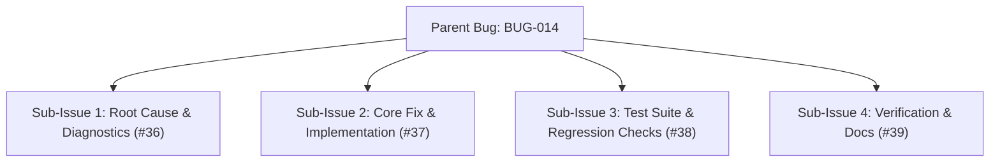

# BUG-014 — Build artifact nesting in src/dist causes recursion crash & duplicate export defaults

**Status:** Resolved  
**Priority:** High  
**Area:** `HELIX/tsconfig.json`, `HELIX/package.json`, `Dockerfile`, `HELIX/src/handlers/`, `HELIX/src/commands/`  
**Remote:** [#35](https://github.com/HELIX-Origin/HELIX-Discord-Bot/issues/35) (Sub-Issues: [#36](https://github.com/HELIX-Origin/HELIX-Discord-Bot/issues/36), [#37](https://github.com/HELIX-Origin/HELIX-Discord-Bot/issues/37), [#38](https://github.com/HELIX-Origin/HELIX-Discord-Bot/issues/38), [#39](https://github.com/HELIX-Origin/HELIX-Discord-Bot/issues/39))  

---

## Lifecycle Flow

---

## Symptoms

1. **Build Artifact Nesting & Recursion**:
   `HELIX/tsconfig.json` had `"outDir": "./src/dist"`. During production builds inside Docker, TypeScript output was written into `src/dist`. When dynamic command loader scanned `commandsDir`, it recursed into `src/dist/src/commands`, triggering an `Invalid string length` error upon importing `refactor.js`.

2. **Duplicate Export Defaults**:
   7 command files (`explain.ts`, `debug.ts`, `docs.ts`, `refactor.ts`, `lint.ts`, `generate.ts`, `inspect.ts`) exported both `export const` and `export default`, violating Rule 02 and causing duplicate entries in command collections.

3. **Gateway Shard & Error Diagnostics**:
   Need for proactive error logging and shard listeners to surface Discord WebSocket events.

---

## Resolution

- **Isolated Dist Output**:
  - Configured `HELIX/tsconfig.json` `outDir` to `./dist` (at `HELIX/` root) and excluded `["node_modules", "dist", "src/dist"]`.
  - Updated `HELIX/package.json` (`"start": "node dist/index.js"`) and `Dockerfile` (`CMD ["node", "HELIX/dist/index.js"]`).
  - Added exclusion guards to `scanCommandFiles`, `scanSlashCommandFiles`, and `scanEventFiles` to ignore `dist`, `node_modules`, and hidden folders.
- **Removed Default Exports**:
  - Removed `export default` across all 7 info command files per Rule 02 and added file-level command deduplication.
- **Gateway Error Listeners & Sanitization**:
  - Added `client.on('error')` and `client.on('shardError')` listeners with informative troubleshooting hints in `HELIX/index.ts`.
  - Added string trimming and quote sanitization in `HELIX/src/env.ts`.
- **Commit Reference**: `5041e7a`
