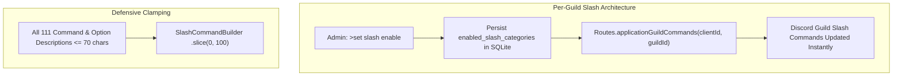

# BUG-015: Slash Command Description Limits & Optional Per-Guild Category Enablement

## Overview

| Attribute | Value |
|---|---|
| **Bug ID** | BUG-015 |
| **Status** | **Resolved** |
| **Parent Issue** | [#40](https://github.com/HELIX-Origin/HELIX-Discord-Bot/issues/40) |
| **Sub-Issues** | [#41](https://github.com/HELIX-Origin/HELIX-Discord-Bot/issues/41) (Diagnostics), [#42](https://github.com/HELIX-Origin/HELIX-Discord-Bot/issues/42) (Core Patch), [#43](https://github.com/HELIX-Origin/HELIX-Discord-Bot/issues/43) (Vitest Suite), [#44](https://github.com/HELIX-Origin/HELIX-Discord-Bot/issues/44) (Verification & Docs) |
| **Severity** | High |
| **Impact Area** | Slash Commands, Discord API Gateway & Guild Configuration |

## Problem Statement

1. **Discord Description Limits**: Discord API enforces a 100-character limit on slash command descriptions and parameter descriptions. Descriptions exceeding this length trigger a runtime `RangeError: Invalid string length` in `discord.js` during command registration.
2. **Global Auto-Registration**: Global slash commands were registering unconditionally on startup across all servers, causing delays and forcing global deployment.
3. **Per-Guild Optional Command Architecture**: Guilds require granular control to selectively enable or disable slash command categories (`info`, `project`, `config`, `mod`, `util`) on a per-guild basis using instant guild application command routes (`Routes.applicationGuildCommands`).

## Root Cause Analysis

- Command descriptions in code-assistance commands (`refactor.ts`, `lint.ts`, etc.) contained descriptions up to 139 characters without automatic clamping.
- `index.ts` ran `registerGlobalSlashCommands` unconditionally during gateway client startup.
- `guild_settings` database table lacked columns to persist per-guild enabled slash categories.

## Solution Architecture



1. **Description Auditing & Clamping**:
   - Shortened all descriptions across all 30 command files to <=70 characters.
   - Added defensive `.slice(0, 100)` to `buildSlashData()` and `addOption()` in `HELIX/src/handlers/slash-handler.ts`.
2. **Optional Per-Guild Slash Commands**:
   - Extended `guild_settings` table with `enabled_slash_categories TEXT` and schema migrations.
   - Added `registerGuildSlashCategories()` and `clearGuildSlashCommands()` to `HELIX/src/handlers/slash-handler.ts`.
   - Removed automatic global registration from `HELIX/index.ts` on startup.
   - Added `>set slash enable/disable/view/clear` commands in `HELIX/src/commands/config/set.ts`.
3. **Comprehensive Test Suite**:
   - Created `tests/unit/handlers/slash-handler.test.ts` with 100% relative imports.
   - Verified 34 test files and 287 unit/integration tests passing.

## Verification

```bash
npm run typecheck
npm test
```
