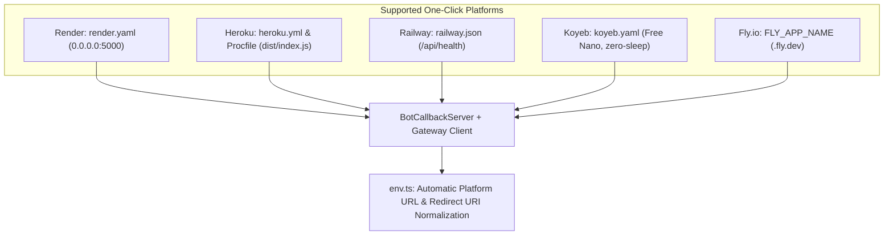

# BUG-016: Multi-Platform One-Click Deployment Sync & Container Runtime Configuration

## Overview

| Attribute | Value |
|---|---|
| **Bug ID** | BUG-016 |
| **Status** | **Resolved** |
| **Parent Issue** | [#45](https://github.com/HELIX-Origin/HELIX-Discord-Bot/issues/45) |
| **Sub-Issues** | [#46](https://github.com/HELIX-Origin/HELIX-Discord-Bot/issues/46) (Diagnostics), [#47](https://github.com/HELIX-Origin/HELIX-Discord-Bot/issues/47) (Core Patch), [#48](https://github.com/HELIX-Origin/HELIX-Discord-Bot/issues/48) (Vitest Suite), [#49](https://github.com/HELIX-Origin/HELIX-Discord-Bot/issues/49) (Verification & Docs) |
| **Severity** | High |
| **Impact Area** | Cloud Deployment, Container Runtime, Port Binding, Platform Auto-Detection |

## Problem Statement

1. **Heroku Runtime Path Drift**: Following the compilation path refactor to `./dist`, `Procfile` and `heroku.yml` retained the outdated `HELIX/src/dist/index.js` target, resulting in `MODULE_NOT_FOUND` upon Heroku deployment.
2. **Missing Railway Manifest**: Railway deployments lacked a declarative `railway.json` configuration specifying health check paths and restart policies.
3. **Container Host Binding**: Internal HTTP servers listened without explicitly binding to `0.0.0.0`, causing intermittent health check failures behind cloud reverse proxies.
4. **Platform URL Detection**: `detectPlatformUrl()` lacked auto-detection for `RAILWAY_PUBLIC_DOMAIN` and `FLY_APP_NAME`.

## Root Cause Analysis

- `Procfile` and `heroku.yml` were not updated when `tsconfig.json` `outDir` was corrected from `./src/dist` to `./dist` in BUG-014.
- Cloud platforms (Docker, Render, Railway, Fly.io, Heroku) require binding to all IPv4 interfaces (`0.0.0.0`) rather than default interface bindings.

## Solution Architecture



1. **Heroku Manifest Synchronization**:
   - Updated `Procfile` and `heroku.yml` to execute `node HELIX/dist/index.js`.
2. **Railway Manifest Configuration**:
   - Added `railway.json` targeting `Dockerfile` with automated health checks on `/api/health`.
3. **Container Host Binding & Startup Diagnostics**:
   - Configured `this.server.listen(this.port, '0.0.0.0')` in `HELIX/src/server.ts`.
   - Added token masking and gateway connection diagnostics in `HELIX/index.ts`.
4. **Expanded URL Auto-Detection**:
   - Added support for `RAILWAY_PUBLIC_DOMAIN` and `FLY_APP_NAME` in `HELIX/src/env.ts`.
5. **Vitest Test Suite Expansion**:
   - Added platform test assertions in `tests/unit/env/env.test.ts`.

## Verification

```bash
npm run typecheck
npm test
```
