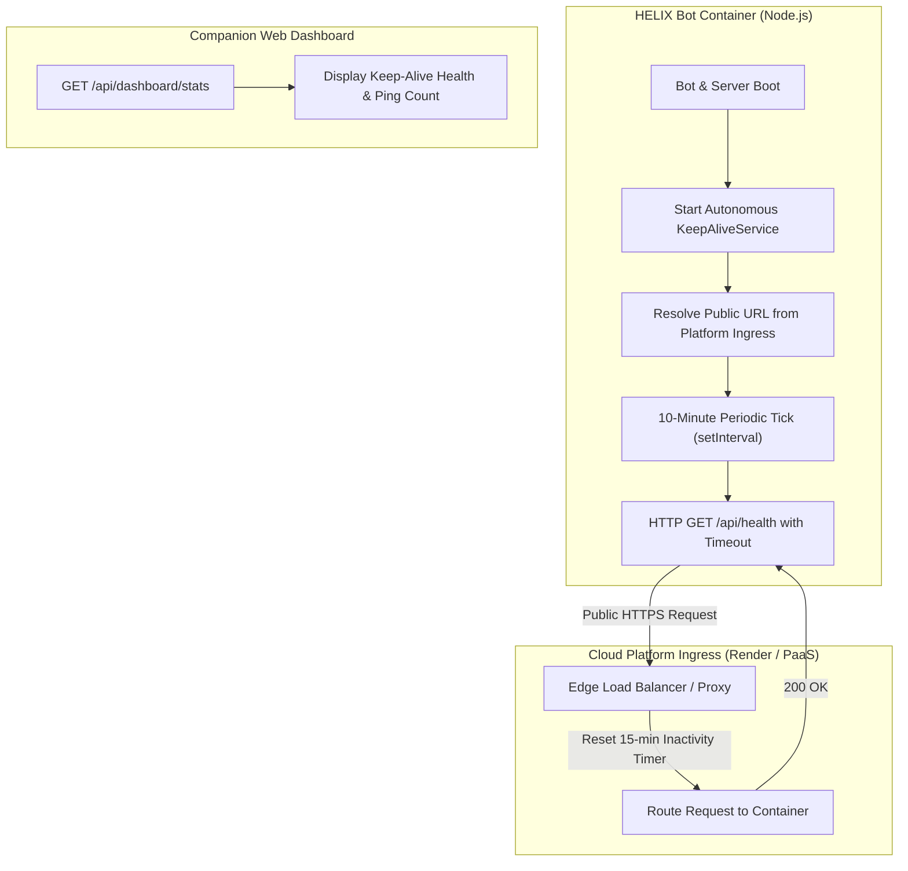

# BUG-017 / FEATURE-017: Built-in Autonomous Keep-Alive Self-Ping Service for Cloud Hosting Platforms

**Parent Issue:** [#50](https://github.com/HELIX-Origin/HELIX-Discord-Bot/issues/50)  
**Status:** Resolved  
**Priority:** High  
**Assigned:** Agent System  

---

## 1. Problem Statement
Cloud hosting platforms on free tiers (specifically Render Free Web Services and dyno-based environments) automatically suspend container runtimes after 15 minutes of inbound HTTP ingress inactivity. When spun down, the Discord Gateway connection drops, severing communication with Discord servers until an external HTTP visit wakes the application up (taking 30–50 seconds for cold starts).

Requiring developers to configure external uptime monitors (e.g. UptimeRobot, Better Stack, cron-job.org) introduces external account overhead, rate limit friction, and setup complexity.

---

## 2. Remediation Architecture

---

## 3. Sub-Issues & GitHub Milestones

| Sub-Issue | Title | GitHub Issue | Status |
|-----------|-------|--------------|--------|
| **Sub-Issue 1** | Edge Load Balancer Ingress Diagnostics & Self-Ping Architecture | [#51](https://github.com/HELIX-Origin/HELIX-Discord-Bot/issues/51) | ✅ Closed |
| **Sub-Issue 2** | Autonomous Keep-Alive Service Engine & Dashboard Integration | [#52](https://github.com/HELIX-Origin/HELIX-Discord-Bot/issues/52) | ✅ Closed |
| **Sub-Issue 3** | Keep-Alive Lifecycle & Network Resiliency Vitest Suite | [#53](https://github.com/HELIX-Origin/HELIX-Discord-Bot/issues/53) | ✅ Closed |
| **Sub-Issue 4** | Verification, Deployment Guides & Bug Tracker Sync | [#54](https://github.com/HELIX-Origin/HELIX-Discord-Bot/issues/54) | ✅ Closed |

---

## 4. Implementation Details

1. **`HELIX/src/keep-alive.ts`**:
   - `startKeepAlive(options)` / `stopKeepAlive()` / `getKeepAliveStatus()` / `pingOnce(url)`.
   - Fires HTTP `fetch` to `targetUrl` every 10 minutes (`600_000` ms) using `AbortSignal.timeout(10_000)`.
   - Graceful fallback and non-blocking timeout handling.
   - `keepAliveTimer.unref()` ensures the timer never prevents graceful process termination.
2. **`HELIX/src/env.ts`**:
   - `getSelfPingConfig()` auto-detects cloud platforms (`RENDER_EXTERNAL_URL`, `KOYEB_PUBLIC_DOMAIN`, `RAILWAY_PUBLIC_DOMAIN`, `HEROKU_APP_NAME`, `FLY_APP_NAME`) and derives target health endpoint `{PLATFORM_URL}/api/health`.
   - Supports manual overrides: `HELIX_SELF_PING=true|false` and `HELIX_SELF_PING_INTERVAL_MS`.
3. **`HELIX/src/server.ts`**:
   - Automatically initializes `startKeepAlive()` when the HTTP server starts listening.
   - Disposes timer cleanly on `server.stop()`.
4. **Dashboard Telemetry (`HELIX/dashboard/`)**:
   - `/api/dashboard/stats` exposes real-time `keepAlive` object.
   - Header badge in `index.html` displays live keep-alive health status and total successful pings.
5. **Vitest Suite**:
   - Added `tests/unit/services/keep-alive.test.ts` (8 test cases).
   - Added `getSelfPingConfig` test suite in `tests/unit/env/env.test.ts` (4 test cases).
   - Total workspace tests: 299 passed across 35 test files (100%).
