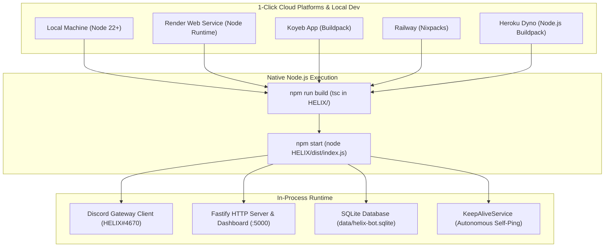

# BUG-018 / TASK-018: Full Deprecation & Removal of Docker Containerization in Favor of Native Node.js Runtime Across All Platforms

**Parent Issue:** [#55](https://github.com/HELIX-Origin/HELIX-Discord-Bot/issues/55)  
**Status:** Resolved  
**Priority:** High  
**Assigned:** Agent System  

---

## 1. Problem Statement
Docker containerization introduces unnecessary layer caching complexity, multi-stage build overhead, platform-specific image architecture friction, and volume directory nesting mismatches on cloud hosting providers (Render, Koyeb, Railway, Heroku). Running directly on native Node.js 22+ runtimes via buildpacks and Nixpacks simplifies deployment, reduces deployment time, enables direct native file system access for the SQLite database (`data/helix-bot.sqlite`), and ensures reliable bot gateway client lifecycle management.

---

## 2. Remediation Architecture

---

## 3. Sub-Issues & GitHub Milestones

| Sub-Issue | Title | GitHub Issue | Status |
|-----------|-------|--------------|--------|
| **Sub-Issue 1** | Docker Artifact Audit & Container Deprecation Diagnostics | [#56](https://github.com/HELIX-Origin/HELIX-Discord-Bot/issues/56) | ✅ Closed |
| **Sub-Issue 2** | Cloud Deployment Manifests & Core Runtime Refactoring | [#57](https://github.com/HELIX-Origin/HELIX-Discord-Bot/issues/57) | ✅ Closed |
| **Sub-Issue 3** | Vitest Test Suite & Build Verification for Native Runtime | [#58](https://github.com/HELIX-Origin/HELIX-Discord-Bot/issues/58) | ✅ Closed |
| **Sub-Issue 4** | Documentation, Deployment Guides & Tracker Sync | [#59](https://github.com/HELIX-Origin/HELIX-Discord-Bot/issues/59) | ✅ Closed |

---

## 4. Implementation Details

1. **Docker Artifact Removal**:
   - Deleted `Dockerfile`, `docker-compose.yml`, `.dockerignore`, `heroku.yml`, `docs/deployment-docker.md`.
2. **Cloud Manifest Refactoring**:
   - `render.yaml`: Switched `runtime: docker` to `runtime: node` with `buildCommand: npm ci && npm --prefix HELIX ci && npm run build` and `startCommand: npm start`.
   - `app.json`: Removed `"stack": "container"` in favor of standard `"buildpacks": [{ "url": "heroku/nodejs" }]`.
   - `railway.json`: Switched `builder: DOCKERFILE` to `builder: NIXPACKS` with `buildCommand` and `startCommand`.
   - `koyeb.yaml`: Switched `image: Dockerfile` to `buildpack` builder with native build and run commands.
3. **Documentation Alignment**:
   - `README.md` & `docs/index.md`: Removed Docker badges and deployment links; updated 1-click Koyeb deploy parameter to `builder=buildpack`.
   - `docs/deployment-render.md`, `docs/deployment-koyeb.md`, `docs/deployment-heroku.md`, `docs/deployment-railway.md`: Updated to native Node.js runtime instructions.
   - `PRIVACY.md`: Removed Docker container references.
4. **Vitest & Build Verification**:
   - Verified clean TypeScript compilation across workspace (`npm run typecheck`).
   - Verified all 35 Vitest suites pass (299 tests, 100% pass rate).
