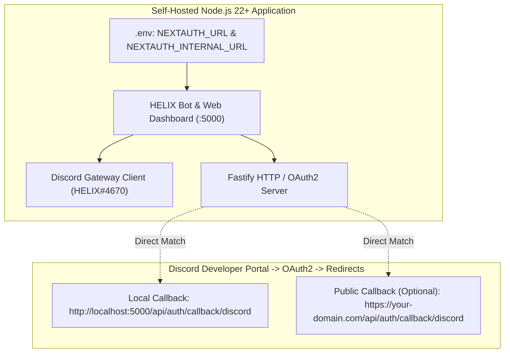

# BUG-019 / TASK-019: Full Deprecation of 1-Click Cloud Deployments & Transition to Static Self-Hosting Architecture

**Parent Issue:** [#60](https://github.com/HELIX-Origin/HELIX-Discord-Bot/issues/60)  
**Status:** Resolved  
**Priority:** High  
**Assigned:** Agent System  

---

## 1. Problem Statement
Cloud PaaS dynamic URL auto-resolution introduced fragile environment variable probing and OAuth2 callback URL mismatches with the Discord Developer Portal, where callback URLs must be pre-registered character-for-character. PaaS free tiers without dedicated static domains cannot reliably pass Discord's OAuth2 authorization flow.

---

## 2. Remediation Architecture

---

## 3. Sub-Issues & GitHub Milestones

| Sub-Issue | Title | GitHub Issue | Status |
|-----------|-------|--------------|--------|
| **Sub-Issue 1** | Diagnostics & Dynamic PaaS Auto-Resolution Deprecation | [#61](https://github.com/HELIX-Origin/HELIX-Discord-Bot/issues/61) | ✅ Closed |
| **Sub-Issue 2** | Core Environment & Static URL Resolution Engine Refactor | [#62](https://github.com/HELIX-Origin/HELIX-Discord-Bot/issues/62) | ✅ Closed |
| **Sub-Issue 3** | Remove 1-Click Manifests & Add Unified Self-Hosting Guide | [#63](https://github.com/HELIX-Origin/HELIX-Discord-Bot/issues/63) | ✅ Closed |
| **Sub-Issue 4** | Vitest Test Suite Updates & GitHub Sync | [#64](https://github.com/HELIX-Origin/HELIX-Discord-Bot/issues/64) | ✅ Closed |

---

## 4. Implementation Details

1. **Environment Engine Refactor (`HELIX/src/env.ts`)**:
   - Removed `detectPlatformUrl()`, `getHerokuAppUrl()`, and platform-specific environment inspections.
   - `getNextAuthUrl()` resolves `NEXTAUTH_URL` if set, otherwise defaults to `http://localhost:<PORT>`.
   - `getNextAuthInternalUrl()` resolves `NEXTAUTH_INTERNAL_URL`, otherwise defaults to `http://localhost:<PORT>`.
   - `getCallbackUrl()` resolves `DISCORD_CALLBACK_URL || getNextAuthUrl()`.
   - `getSelfPingConfig()` auto-activates when `NEXTAUTH_URL` is set to a public URL.
2. **Removed 1-Click Manifests & Obsolete Guides**:
   - Deleted `render.yaml`, `koyeb.yaml`, `railway.json`, `app.json`, `Procfile`.
   - Deleted `docs/deployment-render.md`, `docs/deployment-koyeb.md`, `docs/deployment-heroku.md`, `docs/deployment-railway.md`.
3. **Comprehensive Self-Hosting Documentation**:
   - Created `docs/self-hosting.md` with step-by-step setup guides for:
     - 🐧 **Linux (Ubuntu / Debian / RHEL / Arch)**: Node 22 LTS, systemd service, PM2, UFW firewall, Nginx reverse proxy, Let's Encrypt SSL.
     - 🪟 **Windows (Windows 10 / 11 / Server 2022)**: Node 22, PowerShell, Windows Defender Firewall, NSSM Windows service, PM2.
     - 🍏 **macOS (Ventura, Sonoma, Sequoia)**: Node 22, Homebrew, `launchd` LaunchDaemon plist, Caddy reverse proxy.
4. **Documentation & Spec Alignment**:
   - `README.md` & `docs/index.md`: Removed 1-click cloud buttons and updated documentation links to `docs/self-hosting.md`.
   - `PRIVACY.md`: Removed PaaS vendor references.
5. **Vitest Test Suite**:
   - Updated `tests/unit/env/env.test.ts`, `tests/unit/services/keep-alive.test.ts`, and `tests/integration/dashboard/dashboard-api.test.ts`.
   - All 35 test files and 299 tests pass (100% pass rate).
