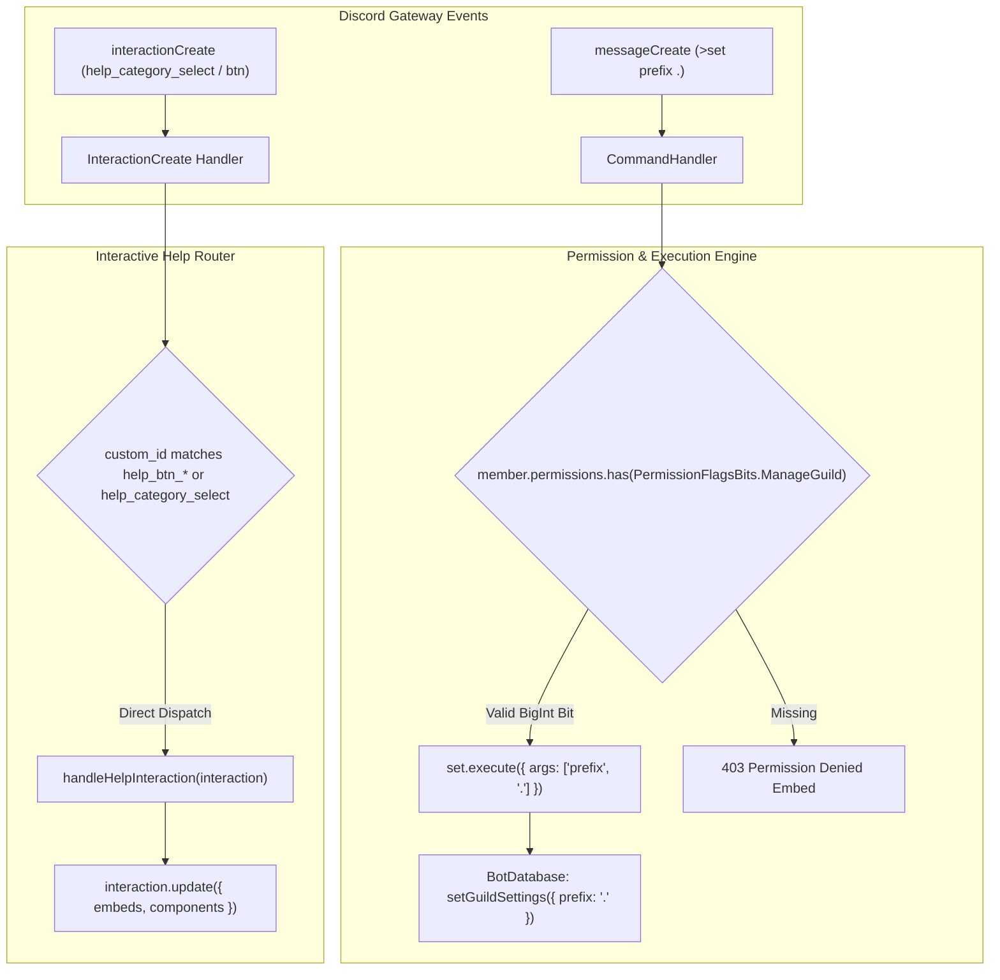

# BUG-020 / TASK-020: Discord PermissionFlagsBits Standardization, Prefix Argument Parsing & Help Interaction Router Refactor

**Parent Issue:** [#65](https://github.com/HELIX-Origin/HELIX-Discord-Bot/issues/65)  
**Status:** Resolved  
**Priority:** High  
**Assigned:** Agent System  

---

## 1. Problem Statement
1. Several commands (`set`, `ban`, `kick`, `unban`, `purge`, `timeout`, `untimeout`, `warn`) previously defined permissions using string-numeric literals (`'32' as any`, `'4' as any`, `'1099511627776' as any`). When checked against Discord.js `PermissionsBitField.has()`, string literals are evaluated as permission flag names rather than numeric bit flags, causing `has()` to evaluate to `false` for all members (including server owners/admins) and blocking command execution with `permission_denied`.
2. The `>set prefix <val>` command re-split `message.content` directly, causing index drift and failing to register or persist new guild command prefixes in the SQLite database.
3. The interactive Help command select menus and buttons lacked a global listener in `interaction-create.ts`, causing Discord to return an interaction timeout error (`The application did not respond in time`).

---

## 2. Remediation Architecture

---

## 3. Sub-Issues & GitHub Milestones

| Sub-Issue | Title | GitHub Issue | Status |
|-----------|-------|--------------|--------|
| **Sub-Issue 1** | Permission Flag Type Audit & PermissionFlagsBits Standardization | [#66](https://github.com/HELIX-Origin/HELIX-Discord-Bot/issues/66) | ✅ Closed |
| **Sub-Issue 2** | Command Argument Parsing & Prefix DB Persistence Fix | [#67](https://github.com/HELIX-Origin/HELIX-Discord-Bot/issues/67) | ✅ Closed |
| **Sub-Issue 3** | Help Command Interactive Component & Dropdown Router Fix | [#68](https://github.com/HELIX-Origin/HELIX-Discord-Bot/issues/68) | ✅ Closed |
| **Sub-Issue 4** | Vitest Test Suite, Set Command Unit Tests & Documentation Sync | [#69](https://github.com/HELIX-Origin/HELIX-Discord-Bot/issues/69) | ✅ Closed |

---

## 4. Implementation Details

1. **PermissionFlagsBits Standardization**:
   - Replaced invalid string-numeric literals with Discord.js `PermissionFlagsBits` enums across:
     - `HELIX/src/commands/config/set.ts`: `[PermissionFlagsBits.ManageGuild]`
     - `HELIX/src/commands/mod/ban.ts`: `[PermissionFlagsBits.BanMembers]`
     - `HELIX/src/commands/mod/kick.ts`: `[PermissionFlagsBits.KickMembers]`
     - `HELIX/src/commands/mod/unban.ts`: `[PermissionFlagsBits.BanMembers]`
     - `HELIX/src/commands/mod/purge.ts`: `[PermissionFlagsBits.ManageMessages]`
     - `HELIX/src/commands/mod/timeout.ts`: `[PermissionFlagsBits.ModerateMembers]`
     - `HELIX/src/commands/mod/untimeout.ts`: `[PermissionFlagsBits.ModerateMembers]`
     - `HELIX/src/commands/mod/warn.ts`: `[PermissionFlagsBits.ModerateMembers]`
   - Updated `HELIX/src/handlers/command-handler.ts` with `formatPermissionName()` to translate `PermissionFlagsBits` into human-readable labels for the Help menu registrar.

2. **Prefix Argument Parsing & DB Persistence**:
   - Normalized argument handling in `HELIX/src/commands/config/set.ts` to read subcommands directly from `args[0]` and values (e.g. `.` for prefix) from `args[1]`.
   - Properly persisted prefix updates to the SQLite database via `BotDatabase.getInstance().setGuildSettings()`.

3. **Help Interaction Handling**:
   - Added interactive router in `HELIX/src/events/interaction-create.ts` for select menus (`help_category_select`) and action buttons (`help_btn_home`, `help_btn_close`).
   - Implemented `handleHelpInteraction()` in `HELIX/src/commands/info/help.ts` with `interaction.update()` to prevent gateway timeout errors.

4. **Vitest Unit Test Suite**:
   - Created `tests/unit/commands/set.test.ts` verifying permissions, prefix configuration, channel/role mentions, and slash command execution.
   - All 37 test suites and 314 tests pass (100% pass rate).
