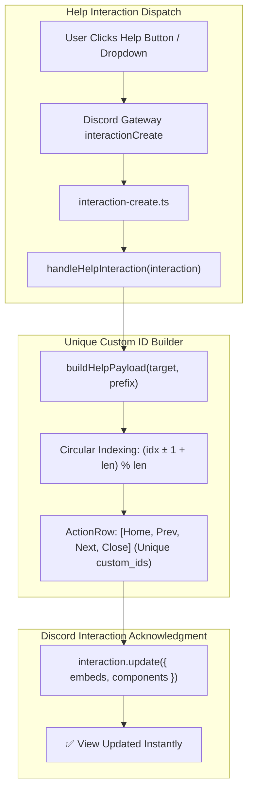

# BUG-021 / TASK-021: Help Component Duplicate Custom ID Elimination & Prefix Dynamic Import Resolution

**Parent Issue:** [#70](https://github.com/HELIX-Origin/HELIX-Discord-Bot/issues/70)  
**Status:** Resolved  
**Priority:** High  
**Assigned:** Agent System  

---

## 1. Problem Statement
1. In `HELIX/src/commands/info/help.ts`, `buildHelpPayload()` assigned `prevCat` to `'home'` when current category index was 0 (`'moderation'`). Because `btnHome` already used `custom_id: 'help_btn_home'`, the resulting ActionRow contained two buttons with identical `custom_id` values (`help_btn_home`). Discord API strictly requires unique `custom_id` per component row; violating this caused Discord to reject `interaction.update()` with HTTP 400 Bad Request / 50035, displaying ephemeral error `❌ Failed to update help view.`.
2. `help.execute()` spawned an in-memory `createMessageComponentCollector()` that raced with global `interactionCreate` event dispatching in `interaction-create.ts`, causing double-acknowledgment collisions (`Interaction already acknowledged`).
3. `loadPrefixCommands()` in `command-handler.ts` relied exclusively on `pathToFileURL(filePath).href`, which failed under dynamic imports in Vitest test environments on paths with encoded characters or spaces.

---

## 2. Remediation Architecture



---

## 3. Sub-Issues & GitHub Milestones

| Sub-Issue | Title | GitHub Issue | Status |
|-----------|-------|--------------|--------|
| **Sub-Issue 1** | Diagnostics & Duplicate Custom ID / Collector Race Condition Identification | [#71](https://github.com/HELIX-Origin/HELIX-Discord-Bot/issues/71) | ✅ Closed |
| **Sub-Issue 2** | Help Component Navigation Circular Indexing & Collector Deprecation | [#72](https://github.com/HELIX-Origin/HELIX-Discord-Bot/issues/72) | ✅ Closed |
| **Sub-Issue 3** | Command Handler Dynamic Import Fallback & Prefix Message Routing Verification | [#73](https://github.com/HELIX-Origin/HELIX-Discord-Bot/issues/73) | ✅ Closed |
| **Sub-Issue 4** | Vitest Test Suite (38 Suites, 321 Tests) & Documentation Sync | [#74](https://github.com/HELIX-Origin/HELIX-Discord-Bot/issues/74) | ✅ Closed |

---

## 4. Implementation Details

1. **Circular Category Indexing in `buildHelpPayload`**:
   - Replaced fragile conditional index arithmetic in `HELIX/src/commands/info/help.ts` with circular modulo indexing:
     ```ts
     const prevCat = target === 'home'
       ? categoryOrder[categoryOrder.length - 1]
       : categoryOrder[(currentIndex - 1 + categoryOrder.length) % categoryOrder.length];

     const nextCat = target === 'home'
       ? categoryOrder[0]
       : categoryOrder[(currentIndex + 1) % categoryOrder.length];
     ```
   - Guaranteed 100% unique `custom_id` values across all buttons on every view target.

2. **Collector Deprecation in `help.execute`**:
   - Removed duplicate ephemeral in-memory collector from `help.execute()` to prevent double interaction acknowledgment.
   - All interactive events are now handled cleanly via `interaction-create.ts` and `handleHelpInteraction()`.

3. **Command Loader Dynamic Import Fallback**:
   - Updated `loadPrefixCommands()` in `HELIX/src/handlers/command-handler.ts` with a relative module path fallback when URL resolution fails.

4. **Vitest Unit Test Suite**:
   - Added `tests/unit/handlers/command-handler.test.ts` testing prefix resolution, command loading, dynamic message routing, and permission enforcement.
   - Added custom ID uniqueness tests in `tests/unit/commands/help.test.ts`.
   - All 38 test suites and 321 tests pass with 100% success rate.
