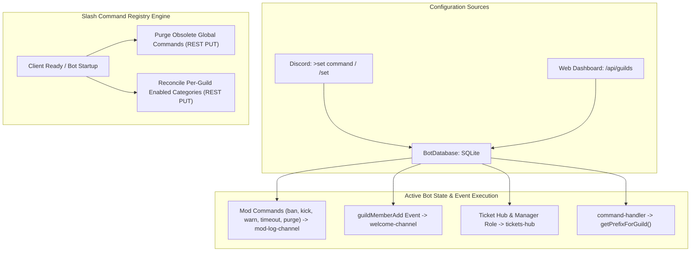

# BUG-022 / TASK-022: Guild Settings End-to-End Bot State Registration & Stale Slash Command Registry Purge

**Parent Issue:** [#75](https://github.com/HELIX-Origin/HELIX-Discord-Bot/issues/75)  
**Status:** In Progress  
**Priority:** High  
**Assigned:** Agent System  

---

## 1. Problem Statement
1. **Guild Settings Bot State Registration**: Settings configured via the `>set` command and the Web Dashboard (such as `welcome-channel`, `mod-log-channel`, `ticket-manager-role`, and `prefix`) are not completely integrated into active bot runtime event listeners and handlers:
   - `welcome-channel`: No `guildMemberAdd` event exists in `HELIX/src/events/` to deliver welcome embeds when new members join.
   - `mod-log-channel`: Moderation actions (`ban`, `kick`, `warn`, `purge`, `timeout`, `untimeout`, `unban`) write records to SQLite `moderation_logs` but never send formatted audit embeds to the configured `modLogChannelId`.
   - `Dashboard /api/guilds`: Partial update payloads send `undefined` fields which default `prefix` to `'>'` instead of preserving existing guild settings in SQLite.
2. **Stale Slash Command Registry**: Previously registered slash commands or commands that have been renamed/removed linger in Discord's gateway cache. HELIX requires a clean reconciliation purge mechanism so only currently valid, enabled slash commands appear in Discord clients.

---

## 2. Remediation Architecture

---

## 3. Sub-Issues & GitHub Milestones

| Sub-Issue | Title | GitHub Issue | Status |
|-----------|-------|--------------|--------|
| **Sub-Issue 1** | Comprehensive Settings Audit & Stale Slash Command Discovery | [#76](https://github.com/HELIX-Origin/HELIX-Discord-Bot/issues/76) | 🔄 In Progress |
| **Sub-Issue 2** | Guild Settings Active Bot State Registration & Event Handlers Implementation | [#77](https://github.com/HELIX-Origin/HELIX-Discord-Bot/issues/77) | ⏳ Queued |
| **Sub-Issue 3** | Stale Slash Command Registry Purge & Gateway Reconciliation Engine | [#78](https://github.com/HELIX-Origin/HELIX-Discord-Bot/issues/78) | ⏳ Queued |
| **Sub-Issue 4** | Vitest Test Suite Expansion, Verification & Documentation Sync | [#79](https://github.com/HELIX-Origin/HELIX-Discord-Bot/issues/79) | ⏳ Queued |

---

## 4. Remediation Plan

1. **Audit & Partial Update Fixes (`HELIX/dashboard/api/guilds.ts` & `BotDatabase`)**:
   - Safe merge of partial update payloads so omitted fields are never overwritten with defaults.
2. **Event & Command Runtime Registration**:
   - Implement `HELIX/src/events/guild-member-add.ts` for welcome channel notifications.
   - Implement `sendModLog()` utility across all moderation commands (`ban`, `kick`, `warn`, `purge`, `timeout`, `untimeout`, `unban`).
3. **Slash Command Registry Purge & Sync**:
   - Add automated global command purge on startup (`Routes.applicationCommands(clientId)` with `[]`) since commands are optional per-guild.
   - Reconcile and cleanly overwrite per-guild application commands based on `enabled_slash_categories`.
4. **Vitest Suite Expansion**:
   - Add unit and integration tests for all newly wired settings flows and slash reconciliation.
