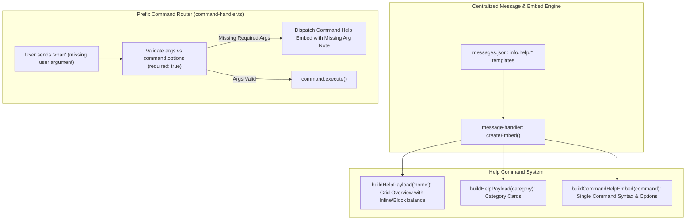

# BUG-023 / TASK-023: Help Command Embed Overhaul & Automated Missing Arguments Help Response

**Parent Issue:** [#80](https://github.com/HELIX-Origin/HELIX-Discord-Bot/issues/80)  
**Status:** Resolved  
**Priority:** High  
**Assigned:** Agent System  

---

## 1. Problem Statement
1. **Help Embed Formatting & Aesthetics**:
   - The current help command embeds (Overview, Category view, and Single Command Detail view) have basic layouts with raw markdown blocks, suboptimal inline/non-inline field arrangements, and unrefined aesthetic presentation.
   - Embeds must be clean, professional, and human-readable, making deliberate use of inline fields (for concise metadata like Category, Permissions, Aliases, Type) and non-inline fields (for Descriptions, Syntax, Options breakdowns, and Examples) to achieve a balanced, structured visual layout.
2. **Missing Required Arguments Feedback**:
   - When a user runs a command without passing required arguments (e.g. `>ban`, `>kick`, `>warn`, `>timeout`, `>scaffold`, `>set`), the bot currently fails or outputs generic error messages instead of guiding the user.
   - Commands should automatically provide their own clean, dedicated help/syntax response when executed without passing their required arguments.

---

## 2. Remediation Architecture

---

## 3. Sub-Issues & GitHub Milestones

| Sub-Issue | Title | GitHub Issue | Status |
|-----------|-------|--------------|--------|
| **Sub-Issue 1** | Help Embed Visual Redesign & Professional Human-Readable Layout Architecture | [#81](https://github.com/HELIX-Origin/HELIX-Discord-Bot/issues/81) | ✅ Resolved |
| **Sub-Issue 2** | Automated Missing Required Arguments Help Dispatcher & Validation Engine | [#82](https://github.com/HELIX-Origin/HELIX-Discord-Bot/issues/82) | ✅ Resolved |
| **Sub-Issue 3** | Command Options & Usage Schema Audit across all 30 Bot Commands | [#83](https://github.com/HELIX-Origin/HELIX-Discord-Bot/issues/83) | ✅ Resolved |
| **Sub-Issue 4** | Vitest Test Suite Expansion, Verification & Documentation Sync | [#84](https://github.com/HELIX-Origin/HELIX-Discord-Bot/issues/84) | ✅ Resolved |

---

## 4. Remediation Plan

1. **Sub-Issue 1: Help Embed Visual Redesign**:
   - Refactor `messages.json` and `HELIX/src/commands/info/help.ts` to output beautiful, polished, and structured Discord embeds.
   - Design balanced inline/non-inline fields for command inspection (Category, Permissions, Aliases inline; Syntax, Description, Options, Subcommands, Examples non-inline).
2. **Sub-Issue 2: Automated Missing Arguments Help Dispatcher**:
   - In `HELIX/src/handlers/command-handler.ts`, check required parameters against `command.options` prior to calling `command.execute()`.
   - If required arguments are missing, return a dedicated clean command help embed highlighting the missing parameter and showing exact syntax usage.
3. **Sub-Issue 3: Command Options & Schema Audit**:
   - Audit all 30 bot commands in `HELIX/src/commands/` (`mod`, `utility`, `info`, `project`, `config`, `plugins`) to guarantee complete options definitions, descriptions, types, and required flags.
4. **Sub-Issue 4: Testing & Verification**:
   - Write comprehensive unit tests in `tests/unit/commands/help.test.ts` and `tests/unit/handlers/command-handler.test.ts`.
   - Run full 40-suite Vitest test suite and TypeScript compiler checks.
   - Synchronize bug tracking docs and GitHub issue lifecycle comments.
