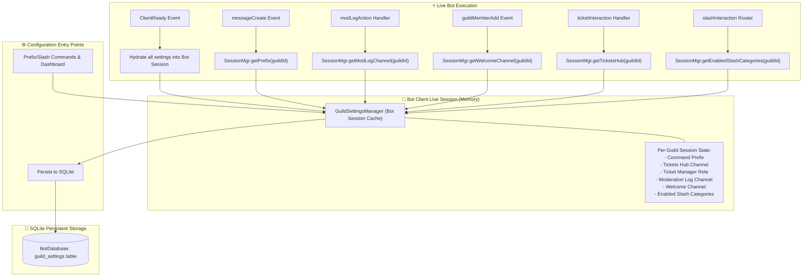

# BUG-024: Universal In-Memory Bot Session State & Unified Database Synchronization

**Parent Issue:** [#85](https://github.com/HELIX-Origin/HELIX-Discord-Bot/issues/85)  
**Status:** Resolved  
**Priority:** High  
**Assigned:** Agent System  

---

## 1. Problem Statement
Currently, guild settings (command prefix, tickets hub channel, ticket manager role, moderation log channel, welcome channel, enabled slash categories) are only queried against SQLite on demand rather than being held directly in the bot's live in-memory session.

When settings are updated (e.g. `>set prefix .`), the bot session must immediately register and apply the new configuration in memory with zero latency, and persist the state to SQLite. Without in-memory bot session management, live commands, message events, and interactions can experience stale configurations or database access discrepancies.

---

## 2. Remediation Architecture

---

## 3. Sub-Issues & GitHub Milestones

| Sub-Issue | Title | GitHub Issue | Status |
|-----------|-------|--------------|--------|
| **Sub-Issue 1** | Universal In-Memory Bot Session State Manager & Preload Engine | [#86](https://github.com/HELIX-Origin/HELIX-Discord-Bot/issues/86) | ✅ Resolved |
| **Sub-Issue 2** | Full Settings Command Suite & Web Dashboard Session Integration | [#87](https://github.com/HELIX-Origin/HELIX-Discord-Bot/issues/87) | ✅ Resolved |
| **Sub-Issue 3** | Event Handlers, Mod Logs, Tickets & Interaction Router Session Refactor | [#88](https://github.com/HELIX-Origin/HELIX-Discord-Bot/issues/88) | ✅ Resolved |
| **Sub-Issue 4** | Vitest Test Suite Expansion, Verification & Documentation Sync | [#89](https://github.com/HELIX-Origin/HELIX-Discord-Bot/issues/89) | ✅ Resolved |

---

## 4. Remediation Plan

1. **Sub-Issue 1: Universal In-Memory Bot Session State Manager & Preload Engine**:
   - Implement `GuildSettingsManager` in `HELIX/src/handlers/settings-manager.ts`.
   - Add `getAllGuildSettings()` to `BotDatabase` in `HELIX/src/db/database.ts`.
   - Preload guild settings into bot session on bot startup in `HELIX/index.ts` and `HELIX/src/events/ready.ts`.
2. **Sub-Issue 2: Full Settings Command Suite & Web Dashboard Integration**:
   - Refactor `HELIX/src/commands/config/set.ts`, `ticket.ts`, and `router.ts` to update the bot's live session state directly and persist to SQLite.
3. **Sub-Issue 3: Event Handlers, Mod Logs, Tickets & Slash Router Integration**:
   - Refactor `command-handler.ts`, `mod-log-handler.ts`, `guild-member-add.ts`, `slash-handler.ts`, and `tickets.ts` to consume settings directly from `GuildSettingsManager`.
4. **Sub-Issue 4: Testing & Verification**:
   - Add comprehensive test suite in `tests/unit/handlers/settings-manager.test.ts`.
   - Verify full test suite, type check, build, and document sync.
