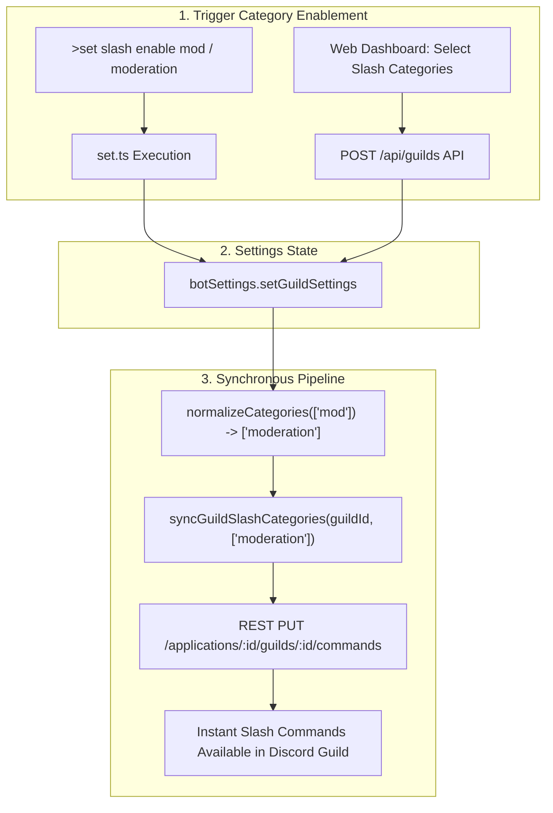

# BUG-025: Instant Guild Slash Command Category Registration, Normalization & REST Synchronization

## Metadata
- **Bug ID**: `BUG-025`
- **Severity**: High
- **Component**: Slash Command Engine, Category Normalization, Guild Settings, Web Dashboard, Discord REST API
- **GitHub Parent Issue**: [#90: BUG-025: Instant Guild Slash Command Category Registration, Normalization & REST Synchronization](https://github.com/HELIX-Origin/HELIX-Discord-Bot/issues/90)
- **Status**: Resolved

---

## Architecture & Failure Flow

---

## Root Cause Analysis
1. **Category Name Normalization Mismatch**:
   - Slash command files declared canonical category names: `'moderation'`, `'utility'`, `'plugins'`, `'project'`, `'config'`, `'info'`.
   - `set.ts` choices presented `'mod'`, `'util'`, `'info'`, `'project'`, `'config'`, `'all'` (omitting `'plugins'`).
   - When filtering `slashCommands`, `catSet.has(def.category)` returned `false` for `'mod'` and `'util'`, resulting in 0 commands matched and an empty array dispatched to Discord REST.
2. **Silent Failure & Error Swallowing**:
   - `set.ts` wrapped `registerGuildSlashCategories` in `.catch(() => null)`, masking REST API failures from user feedback.
3. **Web Dashboard Missing REST Synchronization**:
   - Updating `enabledSlashCategories` via `POST /api/guilds` saved to `botSettings` but did not invoke Discord REST to register/clear guild commands.
4. **Startup Reconciliation Mismatch**:
   - `reconcileAllGuildSlashCommands` on `ClientReady` did not normalize stored categories before querying `slashCommands`.
5. **Credential Resolution**:
   - `registerGuildSlashCategories` and `clearGuildSlashCommands` lacked automated fallback to the active Discord client singleton.

---

## Sub-Issues Tracking

- [x] **Sub-Issue 1**: [#91: Sub-Issue 1: Category Name Normalization & Slash Registry Query Audit](https://github.com/HELIX-Origin/HELIX-Discord-Bot/issues/91) — **Resolved**
  - Created `normalizeCategory(cat: string): string` and `normalizeCategories(cats: string[]): string[]`.
  - Updated `getSlashCommandCategories()` to return canonical categories.
  - Normalized categories in `registerGuildSlashCategories`.
- [x] **Sub-Issue 2**: [#92: Sub-Issue 2: Real-Time Guild Slash REST Sync Engine & Dashboard Hook](https://github.com/HELIX-Origin/HELIX-Discord-Bot/issues/92) — **Resolved**
  - Implemented `syncGuildSlashCategories(guildId: string, categories?: string[])`.
  - Hooked into `HELIX/dashboard/api/guilds.ts`.
  - Updated `reconcileAllGuildSlashCommands` in `ready.ts`.
- [x] **Sub-Issue 3**: [#93: Sub-Issue 3: Slash Enable/Disable Command Suite & Error Handling Overhaul](https://github.com/HELIX-Origin/HELIX-Discord-Bot/issues/93) — **Resolved**
  - Overhauled `set.ts` subcommands and options choices.
  - Exposed descriptive registration feedback and error details.
- [x] **Sub-Issue 4**: [#94: Sub-Issue 4: Vitest Test Suite Expansion, Verification & Documentation Sync](https://github.com/HELIX-Origin/HELIX-Discord-Bot/issues/94) — **Resolved**
  - Added comprehensive unit tests for normalization and guild registration (13 unit tests in `slash-handler.test.ts`).
  - Verified all 41 test suites pass with 0 errors (339/339 tests).
  - Completed documentation and issue closure.
