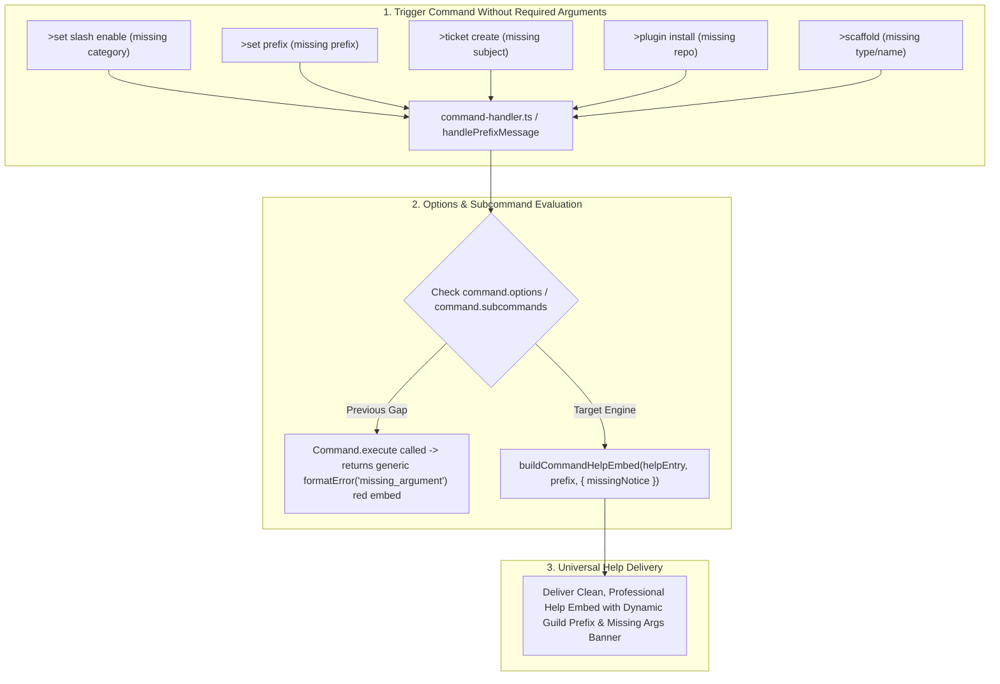

# BUG-026: Universal Subcommand & Command Missing Arguments Help Response Engine

## Metadata
- **Bug ID**: `BUG-026`
- **Severity**: High
- **Component**: Command Handler, Subcommand Parsing, Help Registrar, Message Formatter, Command Execution Suite
- **GitHub Parent Issue**: [#95: BUG-026: Universal Subcommand & Command Missing Arguments Help Response Engine](https://github.com/HELIX-Origin/HELIX-Discord-Bot/issues/95)
- **Status**: Resolved (Closed)

---

## Architecture & Failure Flow

---

## Root Cause Analysis
1. **Subcommand Validation Gap**:
   - `command-handler.ts` previously inspected only top-level `command.options`. Commands with `command.subcommands` (e.g. `set`, `ticket`, `plugin`) were not intercepted before dispatch.
2. **Explicit formatError Calls in Command Handlers**:
   - Across `set.ts`, `plugin.ts`, `ticket.ts`, `scaffold.ts`, `create.ts`, `unban.ts`, etc., manual missing argument checks returned raw `formatError('missing_argument')` error embeds instead of rendering the command help embed.
3. **Contextual Subcommand Notice Generation**:
   - Missing arguments inside subcommands (e.g. `>set slash enable`) did not convey subcommand-specific missing parameter guidance.
4. **SQLite ESM require Compatibility**:
   - `node:sqlite` in `database.ts` required `createRequire(import.meta.url)` to execute safely within Node.js ES Modules, preventing in-process database hydration failures.

---

## Sub-Issues Tracking

- [x] **Sub-Issue 1**: [#96: Sub-Issue 1: Command & Subcommand Options Schema Audit & Validation Engine](https://github.com/HELIX-Origin/HELIX-Discord-Bot/issues/96) — **Resolved**
  - Enhanced `handlePrefixMessage` to evaluate `command.subcommands` and nested options before execution.
- [x] **Sub-Issue 2**: [#97: Sub-Issue 2: Universal Missing Arguments Help Embed Provider & Error Handler Integration](https://github.com/HELIX-Origin/HELIX-Discord-Bot/issues/97) — **Resolved**
  - Enhanced `help-registrar.ts` and `message-handler.ts` to generate command/subcommand help embeds with customized missing argument notices.
- [x] **Sub-Issue 3**: [#98: Sub-Issue 3: Audit & Refactor Across All 30 Commands and Subcommands](https://github.com/HELIX-Origin/HELIX-Discord-Bot/issues/98) — **Resolved**
  - Replaced all remaining raw `missing_argument` error embeds with command help responses across all 30 command files.
- [x] **Sub-Issue 4**: [#99: Sub-Issue 4: Vitest Test Suite Expansion, Verification & Documentation Sync](https://github.com/HELIX-Origin/HELIX-Discord-Bot/issues/99) — **Resolved**
  - Added comprehensive unit tests for subcommand missing argument help dispatch and bot restart persistence.
  - Verified all 41 test suites (342 tests) pass with 0 errors.
  - Completed documentation and closed GitHub issues #95-#99.
