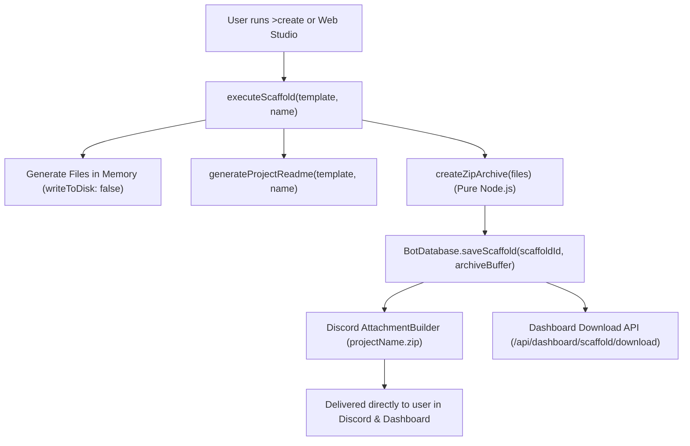

# BUG-027: Database-Backed Scaffolding Architecture, In-Memory ZIP Archive Generation & Discord Attachment Delivery

## Metadata
- **Bug ID**: BUG-027
- **GitHub Parent Issue**: [#100](https://github.com/HELIX-Origin/HELIX-Discord-Bot/issues/100)
- **Sub-Issues**:
  - Sub-Task 1: [#101](https://github.com/HELIX-Origin/HELIX-Discord-Bot/issues/101) — In-Memory Pure Node.js ZIP Archive Generator & CRC-32 Checksum Engine
  - Sub-Task 2: [#102](https://github.com/HELIX-Origin/HELIX-Discord-Bot/issues/102) — SQLite Scaffolds Table Schema & Database Persistence Layer
  - Sub-Task 3: [#103](https://github.com/HELIX-Origin/HELIX-Discord-Bot/issues/103) — Discord Bot Command ZIP Attachment Delivery & Structured Embeds
  - Sub-Task 4: [#104](https://github.com/HELIX-Origin/HELIX-Discord-Bot/issues/104) — Educational Starter Templates, Dashboard Download API & Vitest Test Suite
- **Status**: Resolved
- **Resolution Commit**: `8c60198`

---

## 1. Problem Statement
Previously, project scaffolding generated blueprints by directly writing files to the bot's runtime host filesystem (`process.cwd()` / `./<projectName>`). This prevented Discord users from obtaining or downloading their scaffolded starter projects, polluted host server directories, and provided no archive export mechanism for dashboard users.

---

## 2. Root Cause Analysis
1. `executeScaffold` wrote files directly to local disk without creating in-memory buffers or storing files in the SQLite database.
2. The bot had no in-memory ZIP archiving capability to package starter project trees into downloadable file attachments.
3. Starter project documentation in `README.md` was minimal and did not include step-by-step feature building tutorials.

---

## 3. Architecture & Resolution

1. **Pure Node.js ZIP Engine (`archive-builder.ts`)**: In-memory ZIP buffer creation with Deflate compression and IEEE CRC-32 checksums without external dependencies.
2. **SQLite Database Layer (`database.ts`)**: `scaffolds` table for storing project manifests, file counts, metadata, and binary archive blobs.
3. **Discord Attachment Delivery (`create.ts`)**: Direct `.zip` file attachment delivery via `AttachmentBuilder` alongside `Title + Description + Fields` embeds.
4. **Educational Starter Templates (`readme-generator.ts`)**: Tailored `README.md` guides with setup commands, annotated directory layouts, and step-by-step feature extension tutorials for all 14 templates.
5. **Web Dashboard Integration (`dashboard/api/scaffold.ts`, `html.ts`)**: Direct streaming download endpoint (`/api/dashboard/scaffold/download?id=...`) and Scaffolding Studio one-click download buttons.

---

## 4. Verification
- **Vitest Suite**: 43 test suites, 349 tests passing with 100% success.
- **TypeScript Strict Compilation**: `npm run typecheck` passed with 0 errors.
- **Build**: `npm run build` compiled cleanly.
