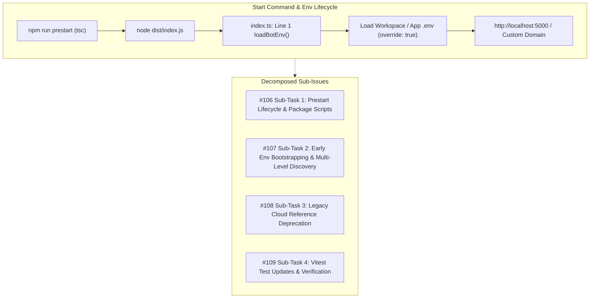

# BUG-028 / TASK-028: Start Command Environment Resolution, Prestart Build Lifecycle Hook & Legacy Platform Reference Deprecation

**Parent Issue:** [#105](https://github.com/HELIX-Origin/HELIX-Discord-Bot/issues/105)  
**Status:** In Progress  
**Priority:** High  
**Assigned:** Agent System  

---

## 1. Problem Statement
When executing `npm run start` (or `npm start`), Node directly runs `dist/index.js` without running `npm run build` beforehand, causing stale or unbuilt code to run when `dist/` is out of date. Additionally, top-level module imports in `HELIX/index.ts` imported client and server modules before `env.js`, leading to potential race conditions with uninitialized `process.env` properties. Finally, legacy comments and test fixtures containing references to Render/Heroku caused confusing URLs and misleading log messages during local development.

---

## 2. Remediation Architecture

---

## 3. Sub-Issues & GitHub Milestones

| Sub-Issue | Title | GitHub Issue | Status |
|-----------|-------|--------------|--------|
| **Sub-Issue 1** | Prestart Lifecycle Build Hooks & Start Command Orchestration | [#106](https://github.com/HELIX-Origin/HELIX-Discord-Bot/issues/106) | 🔄 In Progress |
| **Sub-Issue 2** | Early Environment Bootstrapping Order & Robust `.env` Resolution | [#107](https://github.com/HELIX-Origin/HELIX-Discord-Bot/issues/107) | 🔄 In Progress |
| **Sub-Issue 3** | Deprecate Lingering Render & Cloud Platform References | [#108](https://github.com/HELIX-Origin/HELIX-Discord-Bot/issues/108) | 🔄 In Progress |
| **Sub-Issue 4** | Vitest Test Suite Updates, RFC Example Domain Fixtures & Verification | [#109](https://github.com/HELIX-Origin/HELIX-Discord-Bot/issues/109) | 🔄 In Progress |

---

## 4. Implementation Details

1. **Prestart Build Lifecycle Hooks (`package.json`, `HELIX/package.json`)**:
   - Add `"prestart": "npm run build"` to both `package.json` and `HELIX/package.json`.
   - Ensures `tsc` compiles TypeScript source before Node runs `dist/index.js`.

2. **Top-Level Early Environment Bootstrapping (`HELIX/index.ts`, `HELIX/src/env.ts`)**:
   - Place `loadBotEnv()` at line 1 of `HELIX/index.ts`.
   - Ensure `loadBotEnv()` searches all candidate `.env` paths and applies them with `override: true`.

3. **Deprecate Cloud Platform References (`.env`, `.env.example`, `docs/`, `tests/`)**:
   - Clean up `.env` and `.env.example` comments.
   - Update `HELIX/src/keep-alive.ts` docstrings.
   - Update `docs/self-hosting.md` and `tests/README.md`.
   - Update `tests/unit/services/keep-alive.test.ts` fixtures to RFC example domains (`https://bot.example.com`).

4. **Vitest Verification**:
   - Verify all 43 Vitest suites pass cleanly.
