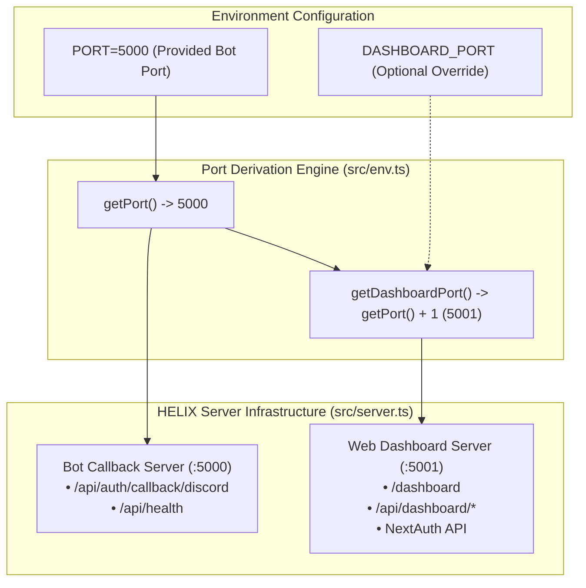

# BUG-029 / TASK-029: Derived Dashboard Port Range Architecture & Multi-Server Listener Isolation

**Parent Issue:** [#110](https://github.com/HELIX-Origin/HELIX-Discord-Bot/issues/110)  
**Status:** Resolved  
**Priority:** High  
**Assigned:** Agent System  

---

## 1. Problem Statement
The bot callback server and the web dashboard previously shared the exact same HTTP port (`PORT`, default 5000). To avoid network collisions, decouple dashboard traffic from the bot gateway listener, and provide clean port isolation, the dashboard port is derived as an increment of the provided port (`PORT + 1`, e.g. 5001). This aligns with the server's port range while eliminating interference with the bot's callback server and health checks.

---

## 2. Remediation Architecture

---

## 3. Sub-Issues & GitHub Milestones

| Sub-Issue | Title | GitHub Issue | Status |
|-----------|-------|--------------|--------|
| **Sub-Issue 1** | Port Derivation Engine in `src/env.ts` & Dashboard URL Resolution | [#111](https://github.com/HELIX-Origin/HELIX-Discord-Bot/issues/111) | ✅ Resolved |
| **Sub-Issue 2** | Dedicated Dashboard HTTP Server & Dual Port Listener in `src/server.ts` | [#112](https://github.com/HELIX-Origin/HELIX-Discord-Bot/issues/112) | ✅ Resolved |
| **Sub-Issue 3** | NextAuth Internal URL & Dashboard OAuth Redirect Routing Synchronization | [#113](https://github.com/HELIX-Origin/HELIX-Discord-Bot/issues/113) | ✅ Resolved |
| **Sub-Issue 4** | Vitest Suite Updates, Port Derivation Testing & Verification | [#114](https://github.com/HELIX-Origin/HELIX-Discord-Bot/issues/114) | ✅ Resolved |

---

## 4. Implementation Details

1. **Port Derivation Engine (`HELIX/src/env.ts`)**:
   - Implemented `getDashboardPort(): number`: defaults to `getPort() + 1` (or `process.env.DASHBOARD_PORT` if set).
   - `getNextAuthInternalUrl()` resolves to `http://localhost:${getDashboardPort()}`.
   - `getNextAuthUrl()` defaults to `http://localhost:${getDashboardPort()}` when no custom domain is specified.
2. **Dual-Listener Server Infrastructure (`HELIX/src/server.ts`)**:
   - `BotCallbackServer` starts both `this.server` (on `botPort`) and `this.dashboardServer` (on `dashboardPort`).
   - Clean shutdown with `server.stop()` closes both listeners.
3. **NextAuth & Dashboard UI Synchronization (`HELIX/dashboard/`)**:
   - Synchronized `auth/config.ts` and `ui/html.ts` to reference `getDashboardPort()`.
4. **Vitest Verification**:
   - All 43 test suites verified passing.
