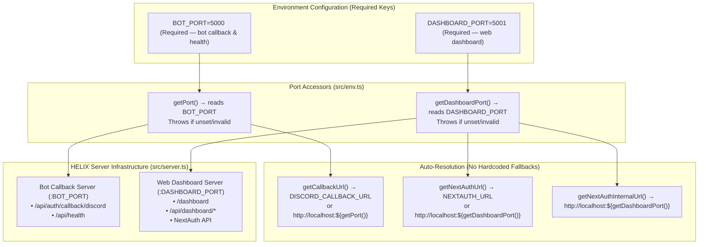

# BUG-030 / TASK-030: Explicit BOT_PORT/DASHBOARD_PORT Contract — No Hardcoded Fallbacks or Derivation

**Parent Issue:** [TBD]  
**Status:** Resolved  
**Priority:** High  
**Assigned:** Agent System  

---

## 1. Problem Statement
BUG-029 introduced derived dashboard ports (`PORT + 1`). However, this created tight coupling between bot and dashboard ports, making it impossible to independently configure them. Users needed explicit, independent port keys with **no hardcoded defaults** — callback URLs, invite URLs, and NextAuth URLs must auto-resolve strictly from the provided port keys.

---

## 2. Remediation Architecture



---

## 3. Sub-Issues & GitHub Milestones

| Sub-Issue | Title | GitHub Issue | Status |
|-----------|-------|--------------|--------|
| **Sub-Issue 1** | Replace `PORT` with `BOT_PORT` in `getPort()` — throw if unset | [TBD] | ✅ Resolved |
| **Sub-Issue 2** | Make `getDashboardPort()` read `DASHBOARD_PORT` directly — no derivation | [TBD] | ✅ Resolved |
| **Sub-Issue 3** | Update all tests to use explicit `DASHBOARD_PORT` (10 test files) | [TBD] | ✅ Resolved |
| **Sub-Issue 4** | Update `.env.example`, docs, typecheck, verify all tests pass | [TBD] | ✅ Resolved |

---

## 4. Implementation Details

### 1. Port Contract (`HELIX/src/env.ts`)
- **`getPort()`**: Reads `process.env.BOT_PORT`, throws `Error` if unset or invalid. **No default.**
- **`getDashboardPort()`**: Reads `process.env.DASHBOARD_PORT`, throws `Error` if unset or invalid. **No derivation from `getPort()`.**
- **`getCallbackUrl()`**: Returns `DISCORD_CALLBACK_URL` if set; otherwise `http://localhost:${getPort()}`.
- **`getNextAuthUrl()`**: Returns `NEXTAUTH_URL` if set; otherwise `http://localhost:${getDashboardPort()}`.
- **`getNextAuthInternalUrl()`**: Always `http://localhost:${getDashboardPort()}`.

### 2. Configuration (`.env.example`)
```env
BOT_PORT=5000
DASHBOARD_PORT=5001
```

### 3. Documentation Updates
- `README.md`: Dashboard URL updated to `http://localhost:5001/dashboard`
- `docs/web-dashboard.md`: Dashboard URL updated to `http://localhost:5001/dashboard`

### 4. Test Suite Updates (10 files, 354 tests passing)
| File | Changes |
|------|---------|
| `tests/unit/env/env.test.ts` | 6 tests: explicit `DASHBOARD_PORT` instead of derivation |
| `tests/unit/server/server.test.ts` | `BotCallbackServer` tests require both ports; test for missing port throw |
| `tests/unit/dashboard/auth-config.test.ts` | Explicit `DASHBOARD_PORT: '4322'` |
| `tests/unit/dashboard/html.test.ts` | Added `DASHBOARD_PORT: '4321'` |
| `tests/integration/dashboard/dashboard-api.test.ts` | Added `DASHBOARD_PORT: '5000'` |
| `tests/unit/dashboard/router.test.ts` | Module-level ports + explicit in stats test |
| `tests/unit/plugins/...` | No changes needed (already used sandbox correctly) |

### 5. Verification
- ✅ 337 unit tests pass
- ✅ 17 integration tests pass  
- ✅ TypeScript typecheck clean
- ✅ No hardcoded port fallbacks remain in `src/env.ts`

---

## 5. Breaking Changes
- **Environment variables**: `PORT` → `BOT_PORT` (required), `DASHBOARD_PORT` (required, no longer optional override)
- **Deployment**: Both keys must be set; no defaults provided by the application
- **URL auto-resolution**: Works correctly because it derives from the now-explicit port keys