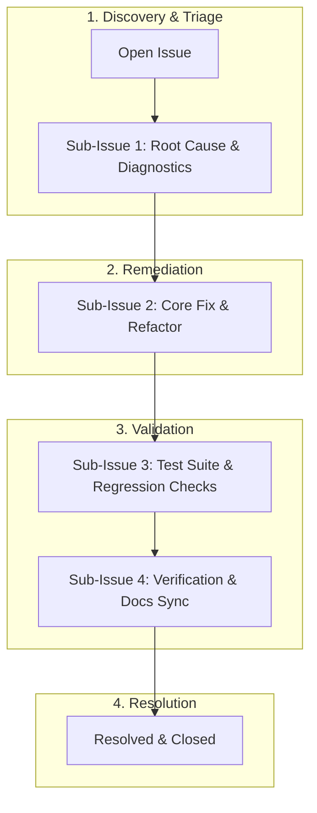

# Bug Tracking Index

This directory contains tracked bugs and issues for HELIX. Every bug has its own tracking file following the standard sub-issue template and is mirrored directly to GitHub Issues.

---

## Bug Lifecycle & Sub-Issue Flow



---

## Tracked Bugs

| Bug ID | Title | Priority | Status | Sub-Issues | GitHub Issue | File |
|--------|-------|----------|--------|------------|--------------|------|
| **BUG-001** | Cross-platform config path resolution for Copilot and Antigravity | Medium | Resolved | 4 Sub-Tasks | [#1](https://github.com/HELIX-Origin/HELIX/issues/1) | [BUG-001](BUG-001-credential-discovery-path.md) |
| **BUG-002** | Template variable interpolation handling in binary game assets | Low | Resolved | 4 Sub-Tasks | [#2](https://github.com/HELIX-Origin/HELIX/issues/2) | [BUG-002](BUG-002-game-engine-template-placeholders.md) |
| **BUG-003** | Heroku deployment fails to auto-detect dynamic app URLs and bot invite URL | High | Resolved | 4 Sub-Tasks | [#3](https://github.com/HELIX-Origin/HELIX/issues/3) | [BUG-003](BUG-003-heroku-deploy-dynamic-url-detection.md) |
| **BUG-004** | Auto-resolve NEXTAUTH_URL and callback URLs from platform detection | Medium | Resolved | 4 Sub-Tasks | [#9](https://github.com/HELIX-Origin/HELIX/issues/9) | [BUG-004](BUG-004-auto-resolve-url-env.md) |
| **BUG-005** | TypeScript strict mode errors after discord.js vanilla migration | High | Resolved | 4 Sub-Tasks | [#10](https://github.com/HELIX-Origin/HELIX/issues/10) | [BUG-005](BUG-005-typescript-strict-mode-errors.md) |
| **BUG-006** | Centralized Message Formatting Engine & messages.json refactor | High | Resolved | 4 Sub-Tasks | [#11](https://github.com/HELIX-Origin/HELIX/issues/11) | [BUG-006](BUG-006-messages-json-formatting-refactor.md) |

---

## Reporting & Sub-Issue Tracking Protocol

All bugs are tracked directly via **GitHub Issues** on the repository (`HELIX-Origin/HELIX`):

1. **Create Parent GitHub Issue**:
   ```bash
   gh issue create --title "[BUG-XXX] Short description" --body-file ".agents/bugs/template.md" --label "bug"
   ```
2. **Decompose into Sub-Issues**:
   For complex issues, decompose the lifecycle into sub-issues:
   - `Sub-Issue 1: Root Cause & Diagnostics`
   - `Sub-Issue 2: Core Fix & Implementation`
   - `Sub-Issue 3: Test Suite & Regression Checks`
   - `Sub-Issue 4: Verification & Docs Sync`
3. **Embed Mermaid Diagrams**:
   Include Mermaid sequence or flow diagrams in the issue description to visualize error triggers and target remediation flow.
4. **Create Local Tracking Mirror**:
   - Copy [template.md](template.md) to `BUG-XXX-<slug>.md`.
   - Update the tracked bug table above.
5. **Multi-Agent Sync**:
   - Synchronize across `.agents/`, `.copilot/`, `.gemini/`, and `.opencode/`.

---

## Remote Issue Protocol
To ensure remote GitHub issue bodies and comments never suffer from Unicode or PowerShell character-escaping errors:
- Review [comment-template.md](comment-template.md).
- **MANDATORY**: Always write bodies and comments to a UTF-8 markdown file and submit via `--body-file <file.md>`.
- Never supply unescaped inline markdown or emojis directly in Windows PowerShell arguments.
