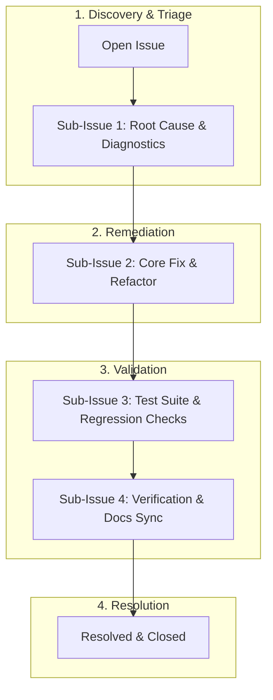

# Bug Tracking Index

This directory contains tracked bugs and issues for HELIX. Every bug has its own tracking file following the standard sub-issue template and is mirrored directly to GitHub Issues.

---

## Bug Lifecycle & Sub-Issue Flow



---

## Tracked Bugs

| Bug ID | Title | Priority | Status | Sub-Issues | GitHub Issue | File |
|--------|-------|----------|--------|------------|--------------|------|
| **BUG-001** | Cross-platform config path resolution for Copilot and Antigravity | Medium | Resolved | 4 Sub-Tasks | [#1](https://github.com/HELIX-Origin/HELIX/issues/1) | [BUG-001](BUG-001-credential-discovery-path.md) |
| **BUG-002** | Template variable interpolation handling in binary game assets | Low | Resolved | 4 Sub-Tasks | [#2](https://github.com/HELIX-Origin/HELIX/issues/2) | [BUG-002](BUG-002-game-engine-template-placeholders.md) |
| **BUG-003** | Heroku deployment fails to auto-detect dynamic app URLs and bot invite URL | High | Resolved | 4 Sub-Tasks | [#3](https://github.com/HELIX-Origin/HELIX/issues/3) | [BUG-003](BUG-003-heroku-deploy-dynamic-url-detection.md) |
| **BUG-004** | Auto-resolve NEXTAUTH_URL and callback URLs from platform detection | Medium | Resolved | 4 Sub-Tasks | [#9](https://github.com/HELIX-Origin/HELIX/issues/9) | [BUG-004](BUG-004-auto-resolve-url-env.md) |
| **BUG-005** | TypeScript strict mode errors after discord.js vanilla migration | High | Resolved | 4 Sub-Tasks | [#10](https://github.com/HELIX-Origin/HELIX/issues/10) | [BUG-005](BUG-005-typescript-strict-mode-errors.md) |
| **BUG-006** | Centralized Message Formatting Engine & messages.json refactor | High | Resolved | 4 Sub-Tasks | [#11](https://github.com/HELIX-Origin/HELIX/issues/11) | [BUG-006](BUG-006-messages-json-formatting-refactor.md) |
| **BUG-007** | Plugin repositories cloned to filesystem instead of stored in database (per-guild repos) | High | Resolved | 4 Sub-Tasks | [#13](https://github.com/HELIX-Origin/HELIX-Discord-Bot/issues/13) | [BUG-007](BUG-007-plugin-repositories-database-backed.md) |
| **BUG-008** | Test suite rebuild incomplete — legacy Vitest suite still active, new modular suite broken | High | Resolved | 4 Sub-Tasks | [#18](https://github.com/HELIX-Origin/HELIX-Discord-Bot/issues/18) | [BUG-008](BUG-008-test-suite-rebuild.md) |
| **BUG-009** | SDK circular import crash — `registerBuiltInSourceProviders is not a function` via provider entry | High | Resolved | 4 Sub-Tasks | [#23](https://github.com/HELIX-Origin/HELIX-Discord-Bot/issues/23) | [BUG-009](BUG-009-sdk-circular-import.md) |
| **BUG-010** | `getUserActiveTicket` returns a nondeterministic ticket when multiple open tickets exist | Medium | Resolved | 3 Sub-Tasks | [#28](https://github.com/HELIX-Origin/HELIX-Discord-Bot/issues/28) | [BUG-010](BUG-010-user-active-ticket-ordering.md) |
| **BUG-011** | `getNextAuthConfig({ botPort })` argument is effectively dead | Low | Resolved | — | [#32](https://github.com/HELIX-Origin/HELIX-Discord-Bot/issues/32) | [BUG-011](BUG-011-nextauth-botport-dead-arg.md) |
| **BUG-012** | Duplicate `app.json` — root and `.github/app.json` drift risk | Low | Resolved | — | [#33](https://github.com/HELIX-Origin/HELIX-Discord-Bot/issues/33) | [BUG-012](BUG-012-duplicate-app-json.md) |
| **BUG-013** | Discord Gateway DisallowedIntents crash & OAuth2 invite redirect_uri error | High | Resolved | — | [#34](https://github.com/HELIX-Origin/HELIX-Discord-Bot/issues/34) | [BUG-013](BUG-013-gateway-intent-fallback-and-clean-invite.md) |
| **BUG-014** | Build artifact nesting in src/dist causes recursion crash & duplicate export defaults | High | Resolved | 4 Sub-Tasks | [#35](https://github.com/HELIX-Origin/HELIX-Discord-Bot/issues/35) | [BUG-014](BUG-014-build-artifact-nesting-and-export-default.md) |
| **BUG-015** | Slash Command Description Limits & Optional Per-Guild Category Enablement | High | Resolved | 4 Sub-Tasks | [#40](https://github.com/HELIX-Origin/HELIX-Discord-Bot/issues/40) | [BUG-015](BUG-015-slash-command-limits-and-per-guild-enablement.md) |
| **BUG-016** | Multi-Platform One-Click Deployment Sync & Container Runtime Configuration | High | Resolved | 4 Sub-Tasks | [#45](https://github.com/HELIX-Origin/HELIX-Discord-Bot/issues/45) | [BUG-016](BUG-016-multi-platform-deployment-sync.md) |
| **BUG-017** | Built-in Autonomous Keep-Alive Self-Ping Service for Cloud Hosting Platforms | High | Resolved | 4 Sub-Tasks | [#50](https://github.com/HELIX-Origin/HELIX-Discord-Bot/issues/50) | [BUG-017](BUG-017-keep-alive-service.md) |
| **BUG-018** | Full Deprecation & Removal of Docker Containerization in Favor of Native Node.js Runtime Across All Platforms | High | Resolved | 4 Sub-Tasks | [#55](https://github.com/HELIX-Origin/HELIX-Discord-Bot/issues/55) | [BUG-018](BUG-018-remove-docker-support.md) |
| **BUG-019** | Full Deprecation of 1-Click Cloud Deployments & Transition to Static Self-Hosting Architecture | High | Resolved | 4 Sub-Tasks | [#60](https://github.com/HELIX-Origin/HELIX-Discord-Bot/issues/60) | [BUG-019](BUG-019-self-hosting-static-urls.md) |
| **BUG-020** | Discord PermissionFlagsBits Standardization, Prefix Argument Parsing & Help Interaction Router Refactor | High | Resolved | 4 Sub-Tasks | [#65](https://github.com/HELIX-Origin/HELIX-Discord-Bot/issues/65) | [BUG-020](BUG-020-permission-flags-and-command-interactions.md) |
| **BUG-021** | Help Component Duplicate Custom ID Elimination & Prefix Dynamic Import Resolution | High | Resolved | 4 Sub-Tasks | [#70](https://github.com/HELIX-Origin/HELIX-Discord-Bot/issues/70) | [BUG-021](BUG-021-help-duplicate-custom-id-and-prefix-routing.md) |
| **BUG-022** | Guild Settings End-to-End Bot State Registration & Stale Slash Command Registry Purge | High | Resolved | 4 Sub-Tasks | [#75](https://github.com/HELIX-Origin/HELIX-Discord-Bot/issues/75) | [BUG-022](BUG-022-guild-settings-registration-and-slash-purge.md) |
| **BUG-023** | Help Command Embed Overhaul & Automated Missing Arguments Help Response | High | Resolved | 4 Sub-Tasks | [#80](https://github.com/HELIX-Origin/HELIX-Discord-Bot/issues/80) | [BUG-023](BUG-023-help-embed-overhaul-and-command-missing-args-help.md) |
| **BUG-024** | Universal In-Memory Bot Session State & Unified Database Synchronization | High | Resolved | 4 Sub-Tasks | [#85](https://github.com/HELIX-Origin/HELIX-Discord-Bot/issues/85) | [BUG-024](BUG-024-guild-settings-bot-session-and-db-sync.md) |
| **BUG-025** | Instant Guild Slash Command Category Registration, Normalization & REST Synchronization | High | Resolved | 4 Sub-Tasks | [#90](https://github.com/HELIX-Origin/HELIX-Discord-Bot/issues/90) | [BUG-025](BUG-025-instant-guild-slash-category-sync.md) |
| **BUG-026** | Universal Subcommand & Command Missing Arguments Help Response Engine | High | Resolved | 4 Sub-Tasks | [#95](https://github.com/HELIX-Origin/HELIX-Discord-Bot/issues/95) | [BUG-026](BUG-026-subcommand-and-command-missing-args-help.md) |
| **BUG-027** | Database-Backed Scaffolding Architecture, In-Memory ZIP Archive Generation & Discord Attachment Delivery | High | Resolved | 4 Sub-Tasks | [#100](https://github.com/HELIX-Origin/HELIX-Discord-Bot/issues/100) | [BUG-027](BUG-027-database-backed-scaffolding-and-zip-archive-delivery.md) |
| **BUG-028** | Start Command Environment Resolution, Prestart Build Lifecycle Hook & Legacy Platform Reference Deprecation | High | Resolved | 4 Sub-Tasks | [#105](https://github.com/HELIX-Origin/HELIX-Discord-Bot/issues/105) | [BUG-028](BUG-028-start-command-env-resolution-and-render-deprecation.md) |
| **BUG-029** | Derived Dashboard Port Range Architecture & Multi-Server Listener Isolation | High | Resolved | 4 Sub-Tasks | [#110](https://github.com/HELIX-Origin/HELIX-Discord-Bot/issues/110) | [BUG-029](BUG-029-derived-dashboard-port-range-and-server-isolation.md) |
| **BUG-030** | Explicit BOT_PORT/DASHBOARD_PORT Contract — No Hardcoded Fallbacks or Derivation | High | Resolved | 4 Sub-Tasks | [TBD] | [BUG-030](BUG-030-explicit-bot-port-dashboard-port-contract.md) |

---

## Reporting & Sub-Issue Tracking Protocol

All bugs are tracked directly via **GitHub Issues** on the repository (`HELIX-Origin/HELIX`):

1. **Create Parent GitHub Issue**:
   ```bash
   gh issue create --title "[BUG-XXX] Short description" --body-file ".agents/bugs/template.md" --label "bug"
   ```
2. **Decompose into Sub-Issues**:
   For complex issues, decompose the lifecycle into sub-issues:
   - `Sub-Issue 1: Root Cause & Diagnostics`
   - `Sub-Issue 2: Core Fix & Implementation`
   - `Sub-Issue 3: Test Suite & Regression Checks`
   - `Sub-Issue 4: Verification & Docs Sync`
3. **Embed Mermaid Diagrams**:
   Include Mermaid sequence or flow diagrams in the issue description to visualize error triggers and target remediation flow.
4. **Create Local Tracking Mirror**:
   - Copy [template.md](template.md) to `BUG-XXX-<slug>.md`.
   - Update the tracked bug table above.
5. **Multi-Agent Sync**:
   - Synchronize across `.agents/`, `.copilot/`, `.gemini/`, and `.opencode/`.

---

## Remote Issue Protocol
To ensure remote GitHub issue bodies and comments never suffer from Unicode or PowerShell character-escaping errors:
- Review [comment-template.md](comment-template.md).
- **MANDATORY**: Always write bodies and comments to a UTF-8 markdown file and submit via `--body-file <file.md>`.
- Never supply unescaped inline markdown or emojis directly in Windows PowerShell arguments.
