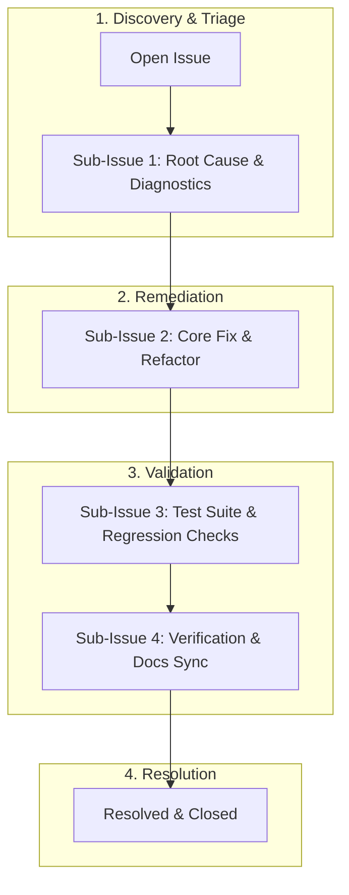

# Bug Tracking Index

This directory contains tracked bugs for Discord RSS (formerly Site-Feed-Discord). Every bug mirrors the sub-issue convention used on GitHub.

---

## Bug Lifecycle & Sub-Issue Flow



---

## Tracked Bugs

| Bug ID | Title | Priority | Status | GitHub Issue | File |
|--------|-------|----------|--------|--------------|------|
| **BUG-001** | State file JSON corruption on concurrent runs | High | Superseded | [#1](https://github.com/HELIX-Origin/Site-Feed-Discord/issues/1) | [BUG-001-state-file-corruption.md](BUG-001-state-file-corruption.md) |
| **BUG-002** | Feed parser fails on non-UTF-8 RSS content | Medium | Superseded | [#2](https://github.com/HELIX-Origin/Site-Feed-Discord/issues/2) | [BUG-002-non-utf8-rss.md](BUG-002-non-utf8-rss.md) |
| **BUG-003** | Cloudflare Challenge Bypass Fails When Playwright Not Installed | High | Superseded | [#3](https://github.com/HELIX-Origin/Site-Feed-Discord/issues/3) | [BUG-003-cloudflare-challenge-bypass.md](BUG-003-cloudflare-challenge-bypass.md) |

> BUG-002 (non-UTF-8) and BUG-003 (Cloudflare) remain conceptually relevant to the rebuild — re-map to `src/feed/parser.ts` and `src/feed/fetch.ts` respectively when re-opened.

---

## Reporting & Sub-Issue Tracking Protocol

All bugs are tracked directly via **GitHub Issues** on the repository (`HELIX-Origin/Site-Feed-Discord`):

1. **Create Parent GitHub Issue**:
   ```bash
   gh issue create --title "[BUG|FEATURE|QUESTION] <Short description>" --body-file ".agents/bugs/template.md" --label "bug|feature-request|question"
   ```
2. **Decompose into Sub-Issues**:
   For complex issues, decompose the lifecycle into sub-issues:
   - `Sub-Issue 1: Root Cause & Diagnostics`
   - `Sub-Issue 2: Core Fix & Implementation`
   - `Sub-Issue 3: Test Suite & Regression Checks`
   - `Sub-Issue 4: Verification & Docs Sync`
3. **Embed Mermaid Diagrams**:
   Include Mermaid sequence or flow diagrams in the issue description to visualize error triggers and target remediation flow.
4. **Create Local Tracking Mirror**:
   - Copy [template.md](template.md) to `[BUG|FEATURE|QUESTION] <Short description>.md`.
   - Update the tracked bug table above.
5. **Multi-Agent Sync**:
   - Synchronize across `.agents/` and `.github/` documentation.
6. **Roadmap-First (Rule 04)**:
   - The issue's first post is the roadmap; progress edits it. New comments only for newly discovered additions.