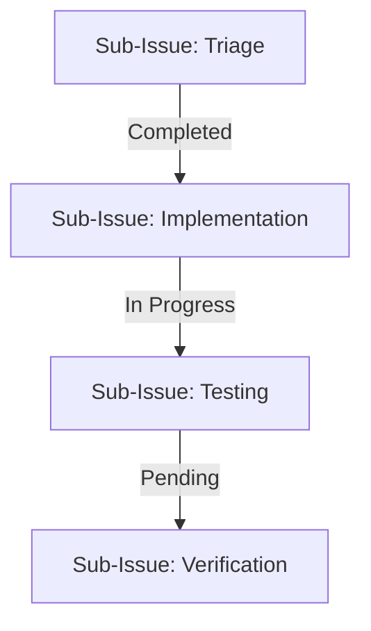
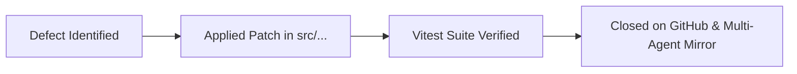

# Issue Comment Template & Safe Remote Posting Protocol

This document defines the standardized templates and protocols for publishing issue comments, status reports, sub-issue updates, and bug resolution notices on GitHub remote issues for **HELIX**.

---

## Safe Remote Posting Protocol (Unicode & Character Preservation)

> [!IMPORTANT]
> **Windows PowerShell Escaping Rules**:
> 1. In Windows PowerShell, the backtick character (\`) is a reserved escape character.
> 2. Passing inline arguments containing backticks or UTF-8 emojis directly to commands like `gh issue comment --body "..."` causes PowerShell to parse backticks as escape sequences, stripping letters or mangling markdown formatting.
> 3. **MANDATORY**: Always write the comment body into a UTF-8 markdown file (e.g. `scratch/comment.md` or `.agents/bugs/comments/`), and supply it using the file flag:
>    ```bash
>    # Posting a new comment:
>    gh issue comment <issue-number> --body-file path/to/comment.md
>
>    # Updating an existing comment:
>    gh api -X PATCH repos/:owner/:repo/issues/comments/<comment-id> -F body=@path/to/comment.md
>    ```

---

## 1. Sub-Issue Progress & Status Update Template

```markdown
### 🔄 Sub-Issue Update: [Title]



**Context**:
[Describe requirement or design refinement]

**Progress Breakdown**:
- [x] Sub-Issue 1: Root Cause & Diagnostics (`#123`)
- [ ] Sub-Issue 2: Core Fix & Implementation (`#124`)
- [ ] Sub-Issue 3: Test Suite & Regression Checks (`#125`)
- [ ] Sub-Issue 4: Verification & Docs (`#126`)

**Next Steps**:
- [ ] Next actionable step
```

---

## 2. Bug Resolution & Verification Template

```markdown
### ✅ Resolved: [BUG-XXX] [Title]



**Root Cause**:
[Why the defect occurred]

**Remediation**:
- Modified `[filepath]` to [fix summary]

**Sub-Issues Closed**:
- [x] Sub-Issue 1: Diagnostics
- [x] Sub-Issue 2: Core Implementation
- [x] Sub-Issue 3: Vitest Test Suite
- [x] Sub-Issue 4: Multi-Agent Docs Sync

**Verification**:
- Automated test: `tests/...test.ts` passed
- Zero regressions
```
