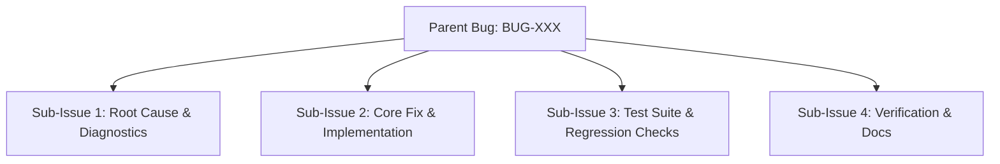
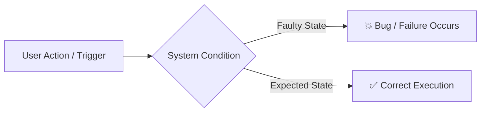
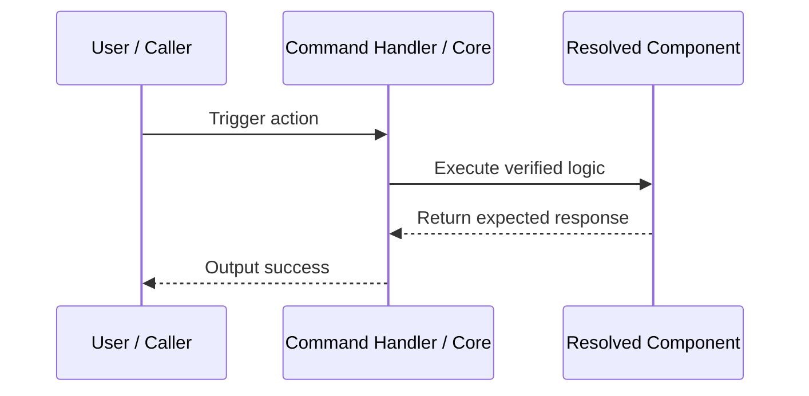

# Bug Report: [BUG-XXX] Title

## Metadata
- **Bug ID**: BUG-XXX
- **Status**: Open / Investigating / In Progress / Testing / Resolved / Closed
- **Priority**: Low / Medium / High / Critical
- **Component**: CLI / Templates / Scaffolding / AI-Auth / Testing / Discord Bot / Plugins / Dashboard
- **Reported Date**: YYYY-MM-DD
- **Target Resolution**: Phase X
- **GitHub Issue**: [#000](https://github.com/HELIX-Origin/HELIX/issues/000)

---

## Sub-Issues & Milestone Breakdown

- [ ] **Sub-Issue 1: Root Cause & Diagnostics** (`#000`)
- [ ] **Sub-Issue 2: Core Fix & Implementation** (`#000`)
- [ ] **Sub-Issue 3: Test Suite & Regression Checks** (`#000`)
- [ ] **Sub-Issue 4: Verification & Docs** (`#000`)

---

## Description
A clear and concise description of what the bug is.

## Reproduction & Error Flow

## Steps to Reproduce
1. Run command `...`
2. Select option `...`
3. Observe error `...`

## Expected Behavior
A concise description of what should happen.

## Actual Behavior
A concise description of what actually happened, including error messages or unexpected files.

## Environment Details
- **OS**: Windows / macOS / Linux
- **Node.js Version**: v22.x
- **HELIX Version**: 1.0.0

## Root Cause Analysis
*(To be filled during investigation)*

## Resolution Architecture

## Resolution & Fix
*(To be filled once resolved with PR or commit reference)*
