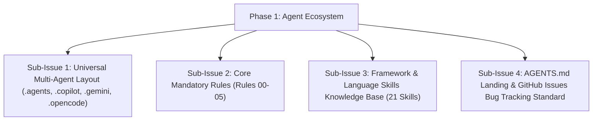

# HELIX - Phase 1: Core Foundation & Agent Ecosystem

## Goals & Objectives
Establish the universal multi-assistant agent ecosystem, mandatory architecture rules, framework skills, and documentation for HELIX.

---

## Sub-Issues & Milestone Breakdown

- [x] **Sub-Issue 1: Multi-Agent Layout**: Universal directory structure across `.agents/`, `.copilot/`, `.gemini/`, and `.opencode/`.
- [x] **Sub-Issue 2: Architecture Rules**: Established non-negotiable invariants:
  - `00-agent-safety-compliance.md`
  - `01-zero-ai-architecture.md`
  - `02-discord-bot-architecture.md`
  - `03-message-formatting.md`
  - `04-remote-issue-protocol.md`
  - `05-documentation-standards.md`
- [x] **Sub-Issue 3: Skills Base**: 21 language and framework skill guides.
- [x] **Sub-Issue 4: Bug Tracking & Docs**: Standardized GitHub Issues mirror and `AGENTS.md`.

---

## Verification & Criteria
1. Multi-assistant directories are tracked in version control and synchronized.
2. Architecture rules enforce zero external AI dependencies and vanilla discord.js standards.
