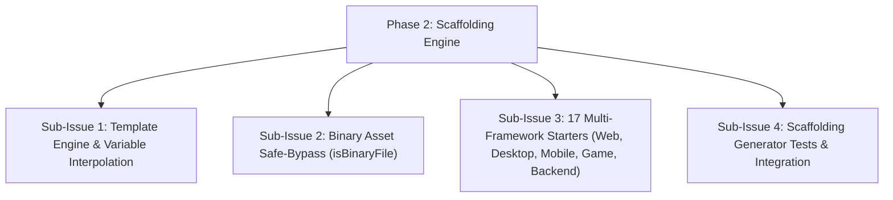

# HELIX - Phase 2: Project Scaffolding Engine & Template System

## Goals & Objectives
Build the core project scaffolding engine, template variable interpolation system, and binary asset preservation engine powering the `>project create` and `>project scaffold` bot commands.

---

## Sub-Issues & Milestone Breakdown

- [x] **Sub-Issue 1: Template Engine**: Variable interpolation (`{{projectName}}`, `{{author}}`, etc.) and conditional logic.
- [x] **Sub-Issue 2: Binary Safety**: Raw buffer copying for images, audio, and binary game assets (`.png`, `.blend`, `.wav`, `.mp3`).
- [x] **Sub-Issue 3: Template Catalog**: 17 production-ready starters across Web (React, Vue, Svelte, Angular), Desktop (Electron, Tauri), Mobile (Flutter, React Native), Game Engines (Unity, Godot, RPG Maker, Ren'Py), and Backend (Rust, Go, Java, Python).
- [x] **Sub-Issue 4: Verification**: Vitest unit & integration tests for end-to-end template generation.

---

## Verification & Criteria
1. Variable substitution executes cleanly without lingering placeholders.
2. Binary assets retain 100% byte integrity during scaffolding.
