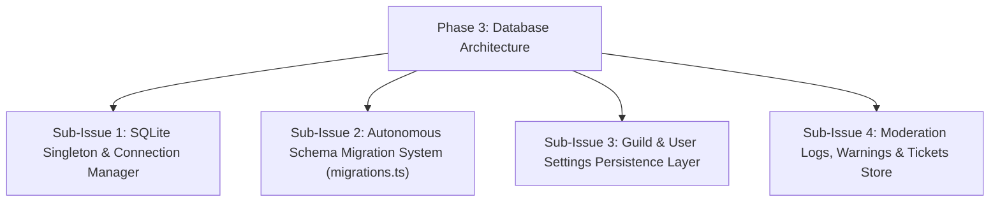

# HELIX - Phase 3: Database Architecture & Autonomous Schema Migrations

## Goals & Objectives
Design and implement the embedded SQLite database singleton (`BotDatabase`) with zero-configuration autonomous schema migrations on boot.

---

## Sub-Issues & Milestone Breakdown

- [x] **Sub-Issue 1: Database Singleton**: `src/db/database.ts` using `better-sqlite3` with WAL mode and fast queries.
- [x] **Sub-Issue 2: Autonomous Migrations**: Automatic forward schema migrations executed on bot startup.
- [x] **Sub-Issue 3: Settings Persistence**: Tables `guild_settings`, `user_settings`, `user_sessions`, and `bot_kv`.
- [x] **Sub-Issue 4: Operational Data**: Tables `tickets`, `moderation_logs`, `warnings`, and `scaffold_history`.

---

## Verification & Criteria
1. Database automatically initializes in `data/helix-bot.sqlite` on first run without external DB servers.
2. Unit tests verify CRUD operations and schema integrity across migrations.
