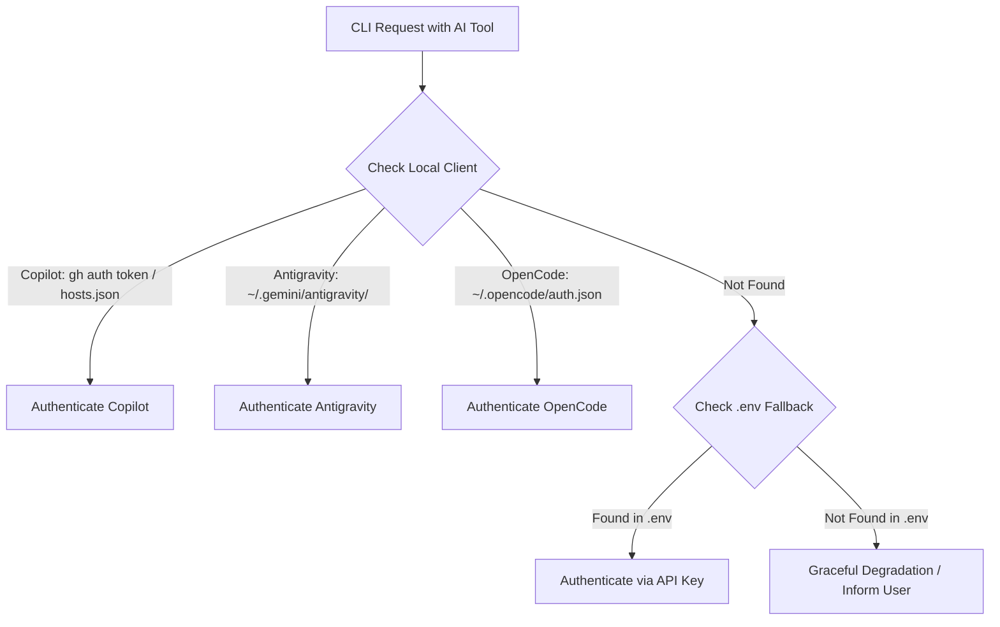

# HELIX CLI - Phase 4: AI Agent Integrations & Credential Discovery

## Goals & Objectives
Integrate AI agent runtimes (**Google Antigravity CLI**, **Open Code Go/Zen**, and **GitHub Copilot**) into HELIX CLI with automatic client credential discovery and `.env` fallback handling.

## Credential Waterfall Strategy



## Features to Implement

### 1. `CredentialResolver` Module
- **GitHub Copilot**:
  - Run `gh auth token` synchronously to leverage existing GitHub CLI logins.
  - Check platform-specific config paths:
    - Windows: `%APPDATA%\GitHub Copilot\hosts.json`
    - macOS/Linux: `~/.config/github-copilot/hosts.json`
  - Fallback to `GITHUB_TOKEN` or `COPILOT_API_KEY` in `.env`.
- **Google Antigravity CLI**:
  - Detect active Antigravity session from `~/.gemini/antigravity/`.
  - Fallback to `ANTIGRAVITY_API_KEY` or `GEMINI_API_KEY` in `.env`.
- **Open Code Go / Zen**:
  - Detect client session from `~/.opencode/auth.json`.
  - Fallback to `OPENCODE_API_KEY` in `.env`.

### 2. `helix ai` CLI Subcommands
```bash
# Display authenticated status for each AI client
helix ai status

# Output example:
# [✓] GitHub Copilot: Authenticated (via GitHub CLI)
# [✓] Google Antigravity: Authenticated (via .env GEMINI_API_KEY)
# [✗] Open Code: Unauthenticated (client not detected, OPENCODE_API_KEY missing)

# Run a test query or verify connection
helix ai test copilot
helix ai test antigravity
helix ai test opencode
```

### 3. Context-Aware Prompt Synthesis
- Ability to package current project context (project type, framework, dependencies, files) to supply as rich context for AI agents when answering queries or generating code.

## Completion Criteria
- `helix ai status` correctly reports client detection or `.env` fallback across all three providers.
- When no clients or keys are available, CLI gracefully suggests adding keys to `.env` without throwing uncaught exceptions.
